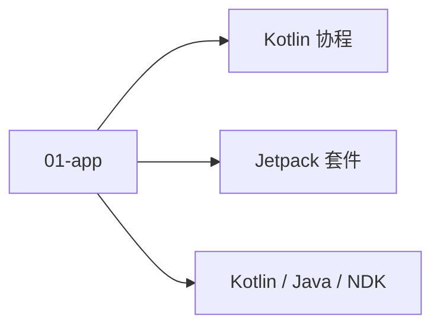

# 01 · 应用层

Android 应用层：语言 + Jetpack + 协程，业务开发核心栈。

## 章节目录

| 节点 | 一句话 |
|------|--------|
| [Kotlin / Java / NDK](./language) | JVM 语言与现代 Android 开发 |
| [Jetpack 套件](./jetpack) | ViewModel / LiveData / Room / Hilt / WorkManager |
| [Kotlin 协程](./coroutine) | 协程作用域 / Dispatchers / Flow |

## 🎯 选型决策

- **新项目**：默认 Kotlin + Jetpack（ViewModel + Hilt + Compose）
- **老项目**：保留 Java，逐步用 Kotlin 迁移新模块
- **性能瓶颈模块**：用 NDK 写 C++

## 📚 学习路径

- **入门**：Kotlin 语法 + Jetpack ViewModel + Coroutine
- **进阶**：Compose UI + Hilt DI + Room
- **高级**：KSP + Baseline Profile + 自定义 Annotation Processor

## 📝 章节目录

- `01-app`：Kotlin / Java / NDK + Jetpack + 协程
- `02-ui`：View 体系 + Compose + 资源
- `03-system`：启动 / IPC / ART / 系统服务
- `04-cross`：跨平台框架与选型
- `05-toolchain`：Gradle + IDE + 发布
- `06-perf`：性能与安全

- **小贴士**：Google 官方推荐 Kotlin + Jetpack + Compose 三件套
- **小贴士**：应用层先学这一章，其他章节按需深入


<!-- auto-enrich:do-not-edit -->

## 实战示例

```bash
# TODO: 在此补充本页主题的实战命令
echo "hello"
```

```yaml
# TODO: 配置示例
key: value
```

## 进阶话题

> TODO: 此节可补充 3-5 段深度内容（如生产环境实战 / 常见错误 / 对比其他方案 / 未来演进）。

补充方向：
- 在生产环境如何配置 / 调优
- 与同类方案的对比（如 A vs B）
- 常见 3-5 个错误及排查
- 进阶阅读资料链接
<!-- auto-enrich:do-not-edit -->

## 🗺 章节目录图

<!-- mermaid-injected:do-not-edit -->


