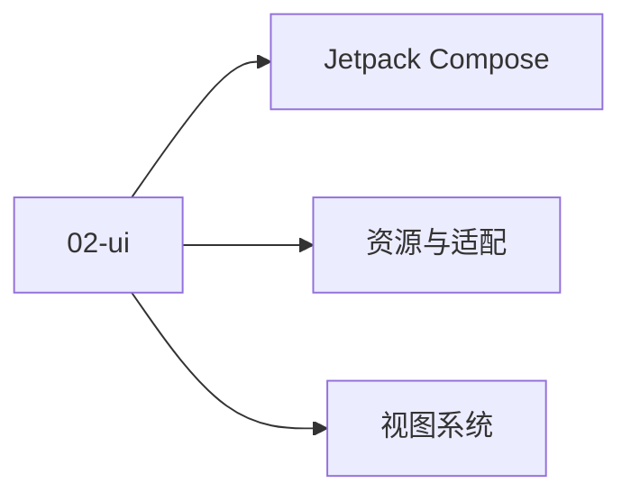

# 02 · UI 体系

UI 体系：传统 View + 现代 Compose + 资源系统。

## 章节目录

| 节点 | 一句话 |
|------|--------|
| [视图系统](./view-system) | Activity / Fragment / View 树 / RecyclerView |
| [Jetpack Compose](./compose) | 状态 / Modifier / Material 3 / 重组优化 |
| [资源与适配](./resource) | 主题 / 颜色 / 字符串 / 屏幕适配 / Drawable |

## 🎯 选型决策

- **新项目**：直接 Compose（Material 3）
- **老项目**：View + Compose 混合（ComposeView 嵌入）
- **重 UI 场景**（复杂自定义）：View 体系仍不可替代

## 📚 学习路径

- **入门**：Compose 基础（State / Modifier）
- **进阶**：状态提升 + 副作用 + 自定义 Layout
- **高级**：重组优化 + 性能分析

## 📝 章节目录

- `02-ui/view-system`：传统 View 三件套
- `02-ui/compose`：Jetpack Compose 声明式
- `02-ui/resource`：主题 / 适配 / 国际化

- **小贴士**：新项目直接 Compose，老项目 View + Compose 混合
- **小贴士**：Material 3 主题支持动态颜色（Android 12+）


## 🔗 延伸阅读

- [Android 官方文档](https://developer.android.com/)
- [Android 源码（AOSP）](https://cs.android.com/)
- [Jetpack 概览](https://developer.android.com/jetpack)


<!-- auto-enrich:do-not-edit -->

## 实战示例

```bash
# TODO: 在此补充本页主题的实战命令
echo "hello"
```

```yaml
# TODO: 配置示例
key: value
```

## 进阶话题

> TODO: 此节可补充 3-5 段深度内容（如生产环境实战 / 常见错误 / 对比其他方案 / 未来演进）。

补充方向：
- 在生产环境如何配置 / 调优
- 与同类方案的对比（如 A vs B）
- 常见 3-5 个错误及排查
- 进阶阅读资料链接
<!-- auto-enrich:do-not-edit -->

## 🗺 章节目录图

<!-- mermaid-injected:do-not-edit -->


