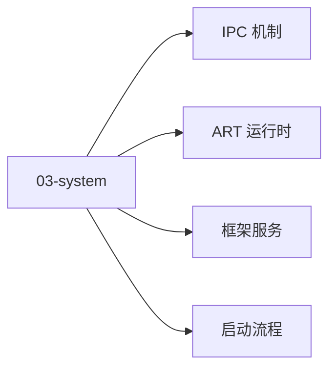

# 03 · 系统层

系统层：从启动到 IPC 到运行时 + 框架服务。

## 章节目录

| 节点 | 一句话 |
|------|--------|
| [启动流程](./startup) | Boot ROM → Zygote → SystemServer → 第一个 App |
| [IPC 机制](./ipc) | Binder / AIDL / Messenger / ContentProvider |
| [ART 运行时](./runtime) | Dex2oat / AOT / GC / ClassLoader |
| [框架服务](./services) | AMS / WMS / PMS / IMS |

## 🎯 选型决策

- **应用开发**：了解启动流程 + IPC（足够 debug）
- **系统开发 / ROM 定制**：深入每个服务的源码
- **性能调优**：ART GC + Choreographer 调度

## 📚 学习路径

- **入门**：阅读 AOSP 启动章节 + dumpsys 工具
- **进阶**：AIDL + Binder 驱动 + SystemServer 启动流程
- **高级**：Trace32 + Perfetto + 内核调度

## 📝 章节目录

- `03-system/startup`：冷启动到第一帧
- `03-system/ipc`：Binder / AIDL
- `03-system/runtime`：ART 编译与 GC
- `03-system/services`：AMS / WMS / PMS / IMS

- **小贴士**：应用开发者只需了解启动 + IPC 即可
- **小贴士**：dumpsys 是日常调试的瑞士军刀


<!-- auto-enrich:do-not-edit -->

## 实战示例

```bash
# TODO: 在此补充本页主题的实战命令
echo "hello"
```

```yaml
# TODO: 配置示例
key: value
```

## 进阶话题

> TODO: 此节可补充 3-5 段深度内容（如生产环境实战 / 常见错误 / 对比其他方案 / 未来演进）。

补充方向：
- 在生产环境如何配置 / 调优
- 与同类方案的对比（如 A vs B）
- 常见 3-5 个错误及排查
- 进阶阅读资料链接
<!-- auto-enrich:do-not-edit -->

## 🗺 章节目录图

<!-- mermaid-injected:do-not-edit -->


