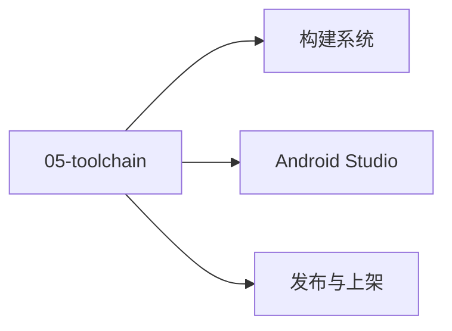

# 05 · 工具链

工具链：构建 + IDE + 发布。

## 章节目录

| 节点 | 一句话 |
|------|--------|
| [构建系统](./gradle) | Gradle KTS / AGP / Build Variants / CI/CD |
| [Android Studio](./ide) | Profiler / Layout Inspector / APK Analyzer |
| [发布与上架](./publish) | App Bundle / Play Console / Firebase |

## 🎯 选型决策

- **构建**：Gradle KTS（强类型 + IDE 友好）
- **性能分析**：Android Studio Profiler + Perfetto
- **发布**：海外 App Bundle + 国内多渠道分包

## 📚 学习路径

- **入门**：Gradle 命令行 + Android Studio 基础
- **进阶**：自定义 Plugin + CI/CD + Baseline Profile
- **高级**：编译期优化 + R8 规则定制

## 📝 章节目录

- `05-toolchain/gradle`：Gradle KTS + AGP
- `05-toolchain/ide`：Android Studio
- `05-toolchain/publish`：发布与上架

- **小贴士**：构建系统用 Gradle KTS（强类型）
- **小贴士**：CI/CD 用 GitHub Actions（免费 + 缓存）


## 🔗 延伸阅读

- [Android 官方文档](https://developer.android.com/)
- [Android 源码（AOSP）](https://cs.android.com/)
- [Jetpack 概览](https://developer.android.com/jetpack)

- **官方文档**：developer.android.com/studio。


<!-- auto-enrich:do-not-edit -->

## 实战示例

```bash
# TODO: 在此补充本页主题的实战命令
echo "hello"
```

```yaml
# TODO: 配置示例
key: value
```

## 进阶话题

> TODO: 此节可补充 3-5 段深度内容（如生产环境实战 / 常见错误 / 对比其他方案 / 未来演进）。

补充方向：
- 在生产环境如何配置 / 调优
- 与同类方案的对比（如 A vs B）
- 常见 3-5 个错误及排查
- 进阶阅读资料链接
<!-- auto-enrich:do-not-edit -->

## 🗺 章节目录图

<!-- mermaid-injected:do-not-edit -->



<!-- svg-injected:do-not-edit -->


