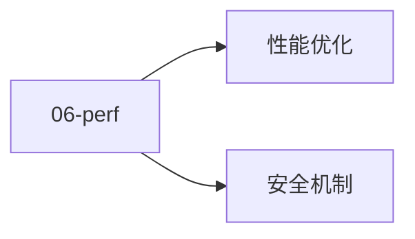

# 06 · 性能与安全

性能与安全：启动 / 内存 / ANR / 权限 / 加密。

## 章节目录

| 节点 | 一句话 |
|------|--------|
| [性能优化](./performance) | 启动 / Baseline Profile / 内存 / ANR / 包大小 |
| [安全机制](./security) | 权限 / Scoped Storage / Network Security / Keystore |

## 🎯 选型决策

- **性能**：先 Profile 后优化（避免过早优化）
- **安全**：默认权限最小化 + HTTPS + ProGuard/R8
- **合规**：用户隐私 + 数据加密 + 第三方 SDK 审计

## 📚 学习路径

- **入门**：LeakCanary + Macrobenchmark + StrictMode
- **进阶**：Perfetto + Baseline Profile + R8 规则
- **高级**：ART 源码 + Choreographer + Kernel Scheduler

## 📝 章节目录

- `06-perf/performance`：启动 / 内存 / ANR
- `06-perf/security`：权限 / 加密 / 证书

- **小贴士**：性能优化先 Profile 后优化
- **小贴士**：安全从设计阶段就考虑（最小权限原则）


## 🔗 延伸阅读

- [Android 官方文档](https://developer.android.com/)
- [Android 源码（AOSP）](https://cs.android.com/)
- [Jetpack 概览](https://developer.android.com/jetpack)


<!-- auto-enrich:do-not-edit -->

## 实战示例

```bash
# TODO: 在此补充本页主题的实战命令
echo "hello"
```

```yaml
# TODO: 配置示例
key: value
```

## 进阶话题

> TODO: 此节可补充 3-5 段深度内容（如生产环境实战 / 常见错误 / 对比其他方案 / 未来演进）。

补充方向：
- 在生产环境如何配置 / 调优
- 与同类方案的对比（如 A vs B）
- 常见 3-5 个错误及排查
- 进阶阅读资料链接
<!-- auto-enrich:do-not-edit -->

## 🗺 章节目录图

<!-- mermaid-injected:do-not-edit -->


