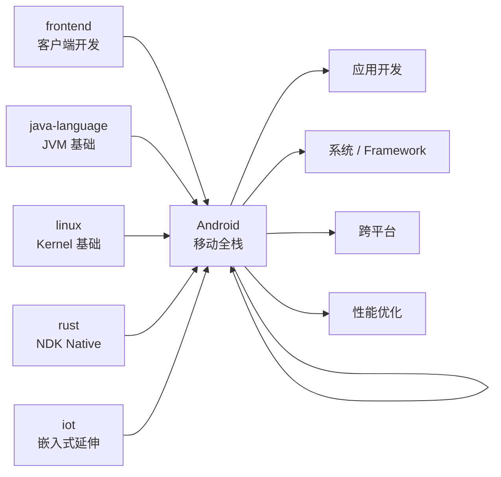
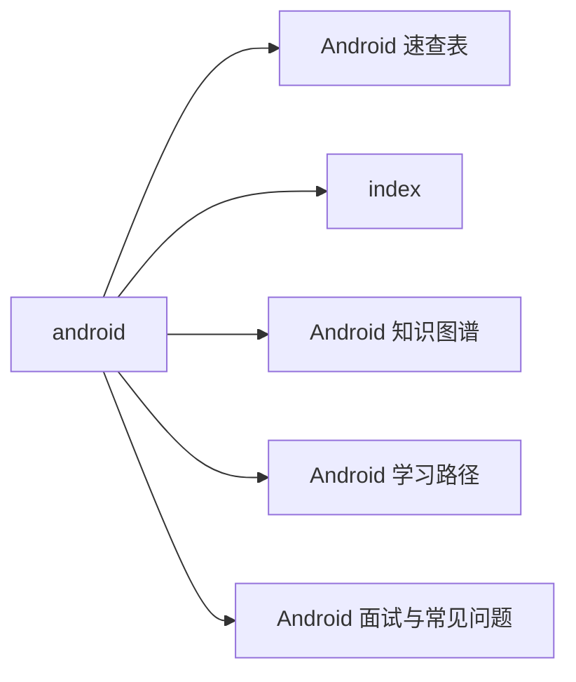

# Android 站在知识图谱中的位置

## 一句话定义

**Android = 基于 Linux Kernel 的移动设备操作系统**：应用层用 Kotlin + Jetpack Compose / 系统层是 Java + C++ + Binder IPC 的横切栈。

## 在 30 站中的关系

## 关键 takeaway

- Android 是横切层：应用层要 frontend + java-language；系统层要 linux + rust

- 90% 应用开发者只要掌握 Jetpack + Compose + 协程就够

- 包大小是生死线：APK 每涨 5MB，安装转化率掉 2%；R8 + ABI split 必须做

- 协程是 Android 异步事实标准：新项目直接 Coroutine + Flow，不用 RxJava

- Compose 是未来：Google 全力推，View 体系只维护不开发

## 与其他站点的关系

| 站点 | 关系 |
|---|---|
| frontend | Android 应用层本质是客户端开发 |
| java-language | Android 历史主语言 + JVM 基础（堆、GC、ClassLoader） |
| linux | Android 基于 Linux Kernel |
| rust | Android NDK / 系统层 Native |
| iot | Android Things / 嵌入式延伸 |
| security | 权限模型 / 密钥库 / mTLS |
| observability | 性能监控 / Crash 上报 |
| architecture | 大型 App 架构（模块化 / 组件化） |

## Android 在 30 站中的定位

Android 是少数几个"贯穿应用 + 系统 + 跨端"三层的技术栈之一。学 Android 等于把前端、移动、底层全打通，对客户端架构师来说性价比极高。

## 章节快速导航

| 章节 | 内容 | 一句话 |
|---|---|---|
| [01 · 应用层](./01-app/) | Kotlin / Jetpack / 协程 | Android 业务开发核心栈 |
| [02 · UI 体系](./02-ui/) | View / Compose / 资源 | UI 开发双路径 |
| [03 · 系统层](./03-system/) | 启动 / IPC / ART / 框架服务 | Framework 底层原理 |
| [04 · 跨平台](./04-cross/) | Flutter / RN / KMP | 跨端方案决策 |
| [05 · 工具链](./05-toolchain/) | Gradle / IDE / 发布 | 工程化与上架 |
| [06 · 性能与安全](./06-perf/) | 启动 / 内存 / ANR / 权限 | 性能基线与安全合规 |

## 🗺 章节目录图

<!-- mermaid-injected:do-not-edit -->

