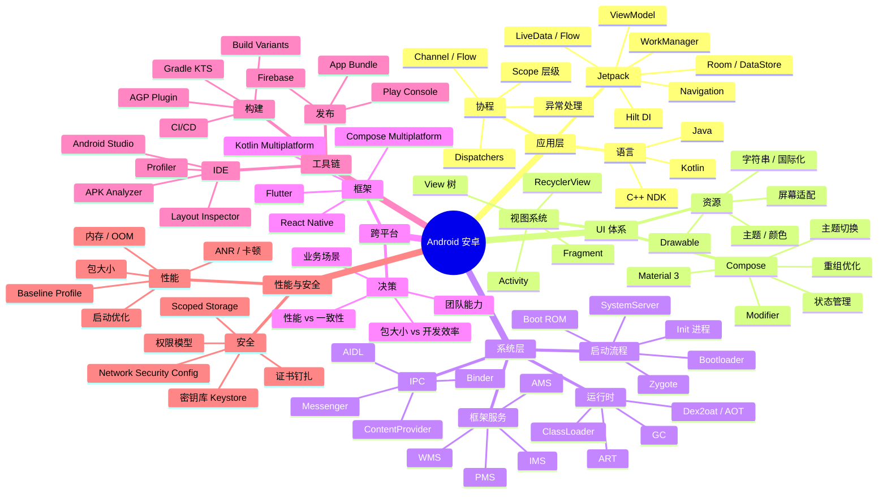

# 🗺️ Android 知识图谱

> 本页用 Mermaid mindmap 展示 Android 全栈知识结构。

## 阅读建议

- **应用开发者**：从 Jetpack → Compose → 协程 入手，再看性能章节
- **系统开发者**：启动流程 → IPC → ART 运行时 → 框架服务
- **跨端架构师**：先看跨平台决策树，再深入某一框架

## 在图谱中的位置

Android 是 frontend（客户端开发）+ java-language（JVM 基础）+ linux（底层 Kernel）+ iot（嵌入式延伸）的横切。如果只看应用层开发，前端基础就够；要做系统层或 NDK，需要补 linux + rust 基础。
