<script setup>
// WhyThisGraph 数据：原写在 :prop="..." 里会触发 Vue 编译错误（多行 YAML 数组），
// 改为 script setup 形式。
const painPoints = [
      "会写 CRUD 却讲不清 CAP 定理",
      "知道消息队列但说不清幂等性设计",
      "调过限流却不懂令牌桶 vs 滑动窗口的区别",
      "用了 Seata 却不知道 AT 模式的 undo_log 怎么工作",
      "部署过微服务但没读过 DDD"
    ]
const goals = [
      "JMM / happens-before / CAS：并发编程的根",
      "CAP / BASE / Raft：分布式系统的根",
      "限流 / 熔断 / 降级：高可用三大法宝",
      "2PC / TCC / Saga：分布式事务选型",
      "DDD：微服务拆分的理论",
      "短链 / 秒杀 / 异地多活：真实案例分析"
    ]
const relatedSites = [
      { site: "system-design", path: "/cap-theorem", label: "系统设计的 CAP" },
      { site: "cloud", path: "/01-overview/microservices", label: "Spring Cloud 落地" },
      { site: "bigdata", path: "/06-warehouse/overview", label: "大数据架构" },
      { site: "kafka", path: "/01-basics/architecture", label: "消息架构" },
      { site: "system-design", path: "/short-url", label: "短链架构案例" }
    ]
</script>

<ClientOnly>
  <WhyThisGraph
    :pain-points="painPoints"
    :goals="goals"
    :related-sites="relatedSites"
    title="🎯 为什么写这个图谱？"
  />
</ClientOnly>

## 🏛️ 分层架构对比（DDD / Clean / Hexagonal）

```mermaid
graph TB
    subgraph Traditional["传统三层架构（贫血模型）"]
        T1["Controller<br/>表现层"] --> T2["Service<br/>业务层"] --> T3["DAO<br/>数据访问层"]
        T3 --> T4[("数据库")]
        T1 --> T2
    end
    
    subgraph DDD["DDD 四层架构（充血模型）"]
        D1["Interface<br/>用户接口层"]
        D2["Application<br/>应用层"]
        D3["Domain<br/>领域层（含聚合根/实体/值对象）"]
        D4["Infrastructure<br/>基础设施层"]
        D1 --> D2 --> D3
        D4 -.实现.-> D3
        D2 -.调用.-> D4
    end
    
    subgraph Hexagonal["六边形 / Clean（端口适配器）"]
        H1["Inbound Adapter<br/>（REST/MQ/CLI）"]
        H2["Application Service<br/>业务用例编排"]
        H3["Domain Model<br/>纯领域逻辑"]
        H4["Outbound Adapter<br/>（DB/Cache/RPC）"]
        H1 --> H2 --> H3
        H4 -.实现 Port.-> H3
        H2 --> H4
    end
    
    style T1 fill:#cbd5e1
    style T2 fill:#cbd5e1
    style T3 fill:#cbd5e1
    style D1 fill:#3b82f6,color:#fff
    style D2 fill:#10b981,color:#fff
    style D3 fill:#f59e0b,color:#fff
    style D4 fill:#8b5cf6,color:#fff
    style H1 fill:#3b82f6,color:#fff
    style H2 fill:#10b981,color:#fff
    style H3 fill:#f59e0b,color:#fff
    style H4 fill:#8b5cf6,color:#fff
```



> **核心区别**：传统三层 = 依赖从上往下贯穿（业务被数据库绑架）；DDD / Clean / 六边形 = 依赖倒置，**领域层不依赖任何外部**，只定义 Port 接口，基础设施层实现 Port。三者本质同源，DDD 强调战术建模（聚合 / 限界上下文），Clean 强调"框架无关 / 可测试"，六边形强调"端口-适配器"边界。

## 🎯 学习路径

```
🧠 并发理论  →  JMM / happens-before / CAS
🧵 线程池   →  ThreadPoolExecutor / 虚拟线程
🏛️ HA 理论  →  CAP / BASE / Raft / 幂等
🚦 限流    →  令牌桶 / 滑动窗口
⚡ 熔断    →  三态机 / Sentinel
🧩 微服务  →  拆分 / 服务发现 / 网关
🔄 分布式事务→  2PC / TCC / Saga
📨 消息队列  →  Kafka / 幂等 / 死信
💾 缓存    →  多级缓存 / 三大问题
🗄️ 分库分表  →  水平拆分 / 路由 / 分布式 ID
🧠 DDD     →  聚合 / 限界上下文 / 事件风暴
🧱 微服务模式→  Service Mesh / Sidecar
🔭 可观测   →  Metrics / Tracing / Logging
🏢 案例   →  秒杀 / 短链 / 异地多活
```

完整路径请看 [📖 学习路径](/path)。

## 💡 学习建议

```
1. 后端工程师  →  并发理论 + 限流 + 熔断 + 案例
2. 架构师    →  CAP / BASE / Saga / DDD / 微服务
3. 面试      →  CAP + 缓存三大问题 + 秒杀设计
4. SRE      →  限流 / 熔断 / 可观测 / 异地多活
```

## 📚 相关阅读（跨站导航）

<!-- xlink-injected:do-not-edit -->

按主题跨站推荐：

- [system-design](https://java-px.bot.cd/system-design/)：系统设计模式
- [cloud](https://java-px.bot.cd/cloud/)：微服务架构
- [cloud-native](https://java-px.bot.cd/cloud-native/)：云原生
- [java](https://java-px.bot.cd/java-web-manual/)：Java 实现
- [kafka](https://java-px.bot.cd/kafka/)：消息架构
- [redis](https://java-px.bot.cd/redis/)：缓存架构
- [observability](https://java-px.bot.cd/observability/)：可观测性
