<ClientOnly>
  <WhyThisGraph
    :pain-points="painPoints"
    :goals="goals"
    :related-sites="relatedSites"
    title="🎯 为什么写这个图谱？"
  />
</ClientOnly>

## 🗺️ GoF 23 模式总览

```mermaid
graph TB
    GoF23["GoF 23 设计模式"]
    
    GoF23 --> C["🏗️ 创建型 5"]
    C --> C1["Singleton<br/>单例"]
    C --> C2["Factory Method<br/>工厂方法"]
    C --> C3["Abstract Factory<br/>抽象工厂"]
    C --> C4["Builder<br/>建造者"]
    C --> C5["Prototype<br/>原型"]
    
    GoF23 --> S["🧩 结构型 7"]
    S --> S1["Adapter<br/>适配器"]
    S --> S2["Bridge<br/>桥接"]
    S --> S3["Composite<br/>组合"]
    S --> S4["Decorator<br/>装饰器"]
    S --> S5["Facade<br/>外观"]
    S --> S6["Flyweight<br/>享元"]
    S --> S7["Proxy<br/>代理"]
    
    GoF23 --> B["🎭 行为型 11"]
    B --> B1["Chain of<br/>Responsibility"]
    B --> B2["Command<br/>命令"]
    B --> B3["Iterator<br/>迭代器"]
    B --> B4["Mediator<br/>中介者"]
    B --> B5["Memento<br/>备忘录"]
    B --> B6["Observer<br/>观察者"]
    B --> B7["State<br/>状态"]
    B --> B8["Strategy<br/>策略"]
    B --> B9["Template Method<br/>模板方法"]
    B --> B10["Visitor<br/>访问者"]
    B --> B11["Interpreter<br/>解释器"]
    
    style GoF23 fill:#8b5cf6,color:#fff,stroke:#7c3aed
    style C fill:#3b82f6,color:#fff,stroke:#2563eb
    style S fill:#10b981,color:#fff,stroke:#059669
    style B fill:#f59e0b,color:#fff,stroke:#d97706
```

> 三大类对应本站三大目录（01 创建型 / 02 结构型 / 03 行为型），每类都有 overview 总览页。

## 📚 相关阅读（跨站导航）

<!-- xlink-injected:do-not-edit -->

按主题跨站推荐：

- [java-language](https://java-px.bot.cd/java-language/)：Java 设计模式
- [java](https://java-px.bot.cd/java-web-manual/)：Java 实现
- [architecture](https://java-px.bot.cd/architecture/)：架构模式
- [system-design](https://java-px.bot.cd/system-design/)：系统设计
