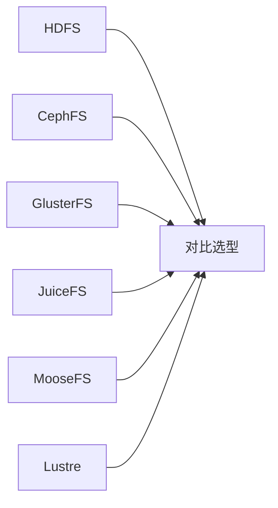

# 03 · 分布式文件系统

<span class="kg-badge kg-badge-distributed">分布式</span>

文件不再局限于单台机器——本章介绍跨节点的文件系统。

## 概念图

<!-- mermaid-injected:do-not-edit -->



## 章节目录

| 节点 | 一句话 |
|------|--------|
| [HDFS 大数据基石](/03-distributed/hdfs) | Hadoop 默认 FS，PB 级顺序写 |
| [CephFS 统一存储](/03-distributed/cephfs) | 块/对象/文件三接口，CRUSH 算法 |
| [GlusterFS 弹性卷](/03-distributed/glusterfs) | 无元数据服务器，弹性哈希 |
| [JuiceFS 云原生](/03-distributed/juicefs) | 元数据 + 对象存储组合 |
| [MooseFS 轻量级](/03-distributed/moosefs) | 简单可靠的小集群方案 |
| [Lustre HPC 超算](/03-distributed/lustre) | 顶级 HPC 并行 FS |
| [架构对比与选型](/03-distributed/compare) | 6 种分布式 FS 一张表 |

## 何时选分布式 FS

- 单机 FS 不够用：单机容量/吞吐瓶颈
- 数据量大且增长快：TB → PB
- 多机并行访问：HPC、大数据、AI 训练
- 跨机房容灾：多副本 + 跨节点分布

## 何时**不**选

- 数据量小（< 10TB）：单机能搞定
- 强一致性要求：分布式 FS 通常是最终一致
- 低延迟要求：分布式 FS 通常 ms~s 级延迟


<!-- auto-enrich:do-not-edit -->

## 实战示例

```bash
# TODO: 在此补充本页主题的实战命令
echo "hello"
```

```yaml
# TODO: 配置示例
key: value
```

## 进阶话题

> TODO: 此节可补充 3-5 段深度内容（如生产环境实战 / 常见错误 / 对比其他方案 / 未来演进）。

补充方向：
- 在生产环境如何配置 / 调优
- 与同类方案的对比（如 A vs B）
- 常见 3-5 个错误及排查
- 进阶阅读资料链接
<!-- auto-enrich:do-not-edit -->
