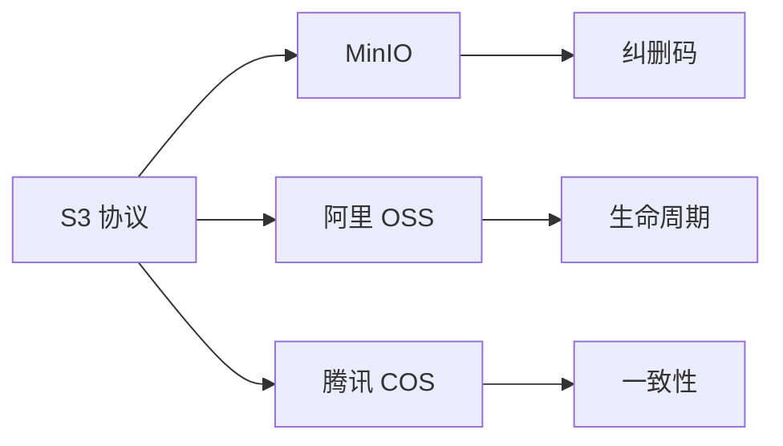

# 04 · 对象存储

<span class="kg-badge kg-badge-object">对象</span>

通过 HTTP API 访问的"桶+对象"模型——云时代的存储基石。

## 概念图

<!-- mermaid-injected:do-not-edit -->



## 章节目录

| 节点 | 一句话 |
|------|--------|
| [S3 协议规范](/04-object/s3-protocol) | 事实标准，RESTful API |
| [MinIO 自建对象存储](/04-object/minio) | S3 兼容的 Go 实现 |
| [阿里云 OSS](/04-object/oss) | 国内最大对象存储 |
| [腾讯云 COS](/04-object/cos) | 腾讯云对象存储 |
| [纠删码 vs 多副本](/04-object/erasure-coding) | 容量 vs 性能的权衡 |
| [多版本与生命周期](/04-object/lifecycle) | 自动归档、过期删除 |
| [一致性模型](/04-object/consistency) | 强一致 vs 最终一致 |

## 对象 vs 文件 vs 块

| 维度 | 块存储 | 文件存储 | 对象存储 |
|------|--------|----------|----------|
| 协议 | SCSI / iSCSI | NFS / SMB / POSIX | HTTP / S3 |
| 访问粒度 | 整卷 | 文件树 | 对象（key-value） |
| 适用 | 数据库 | 共享文件 | 海量非结构化 |
| 性能 | 极低延迟 | 中等 | 较高延迟 |
| 典型 | EBS / 本地盘 | NFS / CephFS | S3 / OSS / MinIO |


<!-- auto-enrich:do-not-edit -->

## 实战示例

```bash
# TODO: 在此补充本页主题的实战命令
echo "hello"
```

```yaml
# TODO: 配置示例
key: value
```

## 进阶话题

> TODO: 此节可补充 3-5 段深度内容（如生产环境实战 / 常见错误 / 对比其他方案 / 未来演进）。

补充方向：
- 在生产环境如何配置 / 调优
- 与同类方案的对比（如 A vs B）
- 常见 3-5 个错误及排查
- 进阶阅读资料链接
<!-- auto-enrich:do-not-edit -->
