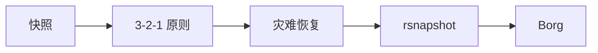

# 11 · 备份与快照

<span class="kg-badge kg-badge-backup">备份</span>

数据保护——从快照到异地容灾。

## 概念图

<!-- mermaid-injected:do-not-edit -->



## 章节目录

| 节点 | 一句话 |
|------|--------|
| [快照技术对比](/11-backup/snapshot) | LVM / ZFS / Btrfs / EBS |
| [Borg 增量备份](/11-backup/borg) | 去重压缩 + 加密 |
| [restic 云原生备份](/11-backup/restic) | S3 友好的现代备份工具 |
| [3-2-1 备份原则](/11-backup/3-2-1) | 数据保护方法论 |
| [灾难恢复 RPO/RTO](/11-backup/dr) | SLA 设计 |

## 快照 ≠ 备份

> ⚠️ **快照不是备份**——快照在同一存储介质上，如果磁盘损坏，快照和原数据一起没。
>
> **备份 = 数据副本 + 异地存储 + 时间点恢复能力**

```
快照：同盘，几乎瞬时，无独立副本
备份：异盘/异地，独立副本，可恢复历史
```

## 选型速查

| 数据量 | 推荐方案 |
|--------|---------|
| < 1 TB | Borg 到外接硬盘 |
| 1-100 TB | restic + S3 / OSS |
| > 100 TB | 企业级备份软件（Veeam / Commvault）|


<!-- auto-enrich:do-not-edit -->

## 进阶话题

> TODO: 此节可补充 3-5 段深度内容（如生产环境实战 / 常见错误 / 对比其他方案 / 未来演进）。

补充方向：
- 在生产环境如何配置 / 调优
- 与同类方案的对比（如 A vs B）
- 常见 3-5 个错误及排查
- 进阶阅读资料链接
<!-- auto-enrich:do-not-edit -->
