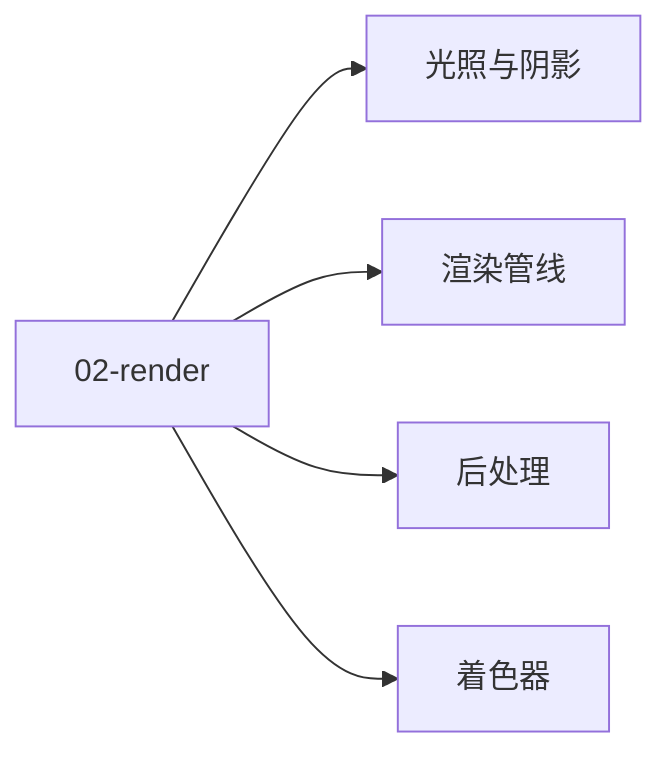

# 02 · 渲染

游戏渲染：管线 / 光照 / 着色器 / 后处理。

## 章节目录

| 节点 | 一句话 |
|------|--------|
| [渲染管线](./pipeline) | 前向 / 延迟 / Clustered / 光追 |
| [光照与阴影](./lighting) | PBR / IBL / GI / 阴影 |
| [着色器](./shader) | HLSL / Shader Graph / Compute |
| [后处理](./postprocess) | Bloom / SSAO / TAA / Color Grading |

## 🎯 选型决策

- **入门**：引擎默认管线 + Shader Graph
- **进阶**：手写 HLSL + 自定义后处理
- **高级**：Forward+ / 光追 / 自研 RHI

## 📚 学习路径

- **入门**：PBR 原理 + 引擎材质
- **进阶**：渲染管线源码 + GPU 优化
- **高级**：实时 GI / 路径追踪


## 📝 章节目录

[渲染管线](./pipeline) / [光照](./lighting) / [着色器](./shader) / [后处理](./postprocess)

## 🛠️ 实战提示

图形程序员进阶路线：管线 → 光照 → 着色器 → GPU 优化。

## 🔗 延伸阅读

- [GameDev.net](https://www.gamedev.net/)
- [GDC Vault](https://www.gdcvault.com/)
- [Unity Manual](https://docs.unity3d.com/Manual/index.html)
- [Unreal Engine Docs](https://docs.unrealengine.com/)


<!-- auto-enrich:do-not-edit -->

## 实战示例

```bash
# TODO: 在此补充本页主题的实战命令
echo "hello"
```

```yaml
# TODO: 配置示例
key: value
```

## 进阶话题

> TODO: 此节可补充 3-5 段深度内容（如生产环境实战 / 常见错误 / 对比其他方案 / 未来演进）。

补充方向：
- 在生产环境如何配置 / 调优
- 与同类方案的对比（如 A vs B）
- 常见 3-5 个错误及排查
- 进阶阅读资料链接
<!-- auto-enrich:do-not-edit -->

## 🗺 章节目录图

<!-- mermaid-injected:do-not-edit -->



<!-- svg-injected:do-not-edit -->


