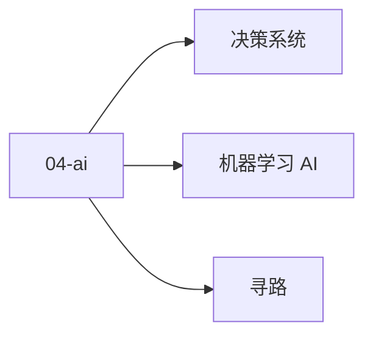

# 04 · AI

游戏 AI：寻路 / 决策 / 机器学习。

## 章节目录

| 节点 | 一句话 |
|------|--------|
| [寻路](./pathfinding) | A* / NavMesh / Flow Field |
| [决策系统](./decision) | FSM / 行为树 / 效用 / GOAP |
| [机器学习 AI](./ml) | 强化学习 / 神经网络 NPC |

## 🎯 选型决策

- **简单 NPC**：FSM
- **复杂 NPC**：行为树（行业标准）
- **前沿**：强化学习（赛车 / RTS）

## 📚 学习路径

- **入门**：引擎 NavMesh + FSM
- **进阶**：行为树 + Utility AI
- **高级**：GOAP + 强化学习


## 📝 章节目录

[寻路](./pathfinding) / [决策](./decision) / [ML AI](./ml)

## 🛠️ 实战提示

游戏 AI 主流是行为树，强化学习是前沿。

## 🔗 延伸阅读

- [GameDev.net](https://www.gamedev.net/)
- [GDC Vault](https://www.gdcvault.com/)
- [Unity Manual](https://docs.unity3d.com/Manual/index.html)
- [Unreal Engine Docs](https://docs.unrealengine.com/)

- **实战提示**：从引擎默认配置入手，按需自定义。
- **官方文档**：参考 Unity / Unreal / Godot 最新 LTS 版本。


<!-- auto-enrich:do-not-edit -->

## 实战示例

```bash
# TODO: 在此补充本页主题的实战命令
echo "hello"
```

```yaml
# TODO: 配置示例
key: value
```

## 进阶话题

> TODO: 此节可补充 3-5 段深度内容（如生产环境实战 / 常见错误 / 对比其他方案 / 未来演进）。

补充方向：
- 在生产环境如何配置 / 调优
- 与同类方案的对比（如 A vs B）
- 常见 3-5 个错误及排查
- 进阶阅读资料链接
<!-- auto-enrich:do-not-edit -->

## 🗺 章节目录图

<!-- mermaid-injected:do-not-edit -->


