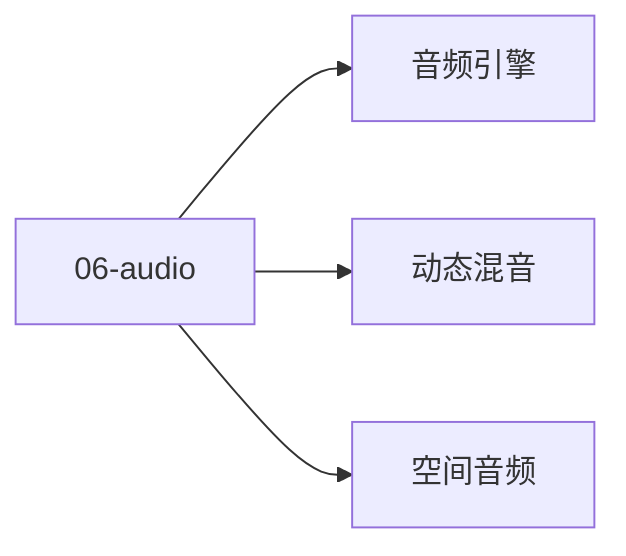

# 06 · 音频

游戏音频：空间 / 动态混音 / 音频引擎。

## 章节目录

| 节点 | 一句话 |
|------|--------|
| [空间音频](./spatial) | HRTF / 3D 衰减 / 声障 |
| [动态混音](./mix) | Snapshot / 实时参数 / 总线 |
| [音频引擎](./engine) | Wwise / FMOD / 内置 |

## 🎯 选型决策

- **3A**：Wwise（行业标准）
- **中型**：FMOD
- **休闲**：引擎内置

## 📚 学习路径

- **入门**：AudioSource + 3D
- **进阶**：Wwise / FMOD 事件系统
- **高级**：自适应音乐 + 程序化音效


## 📝 章节目录

[空间音频](./spatial) / [动态混音](./mix) / [音频引擎](./engine)

## 🛠️ 实战提示

游戏音频 50% 沉浸感来自音频。

## 🔗 延伸阅读

- [GameDev.net](https://www.gamedev.net/)
- [GDC Vault](https://www.gdcvault.com/)
- [Unity Manual](https://docs.unity3d.com/Manual/index.html)
- [Unreal Engine Docs](https://docs.unrealengine.com/)

- **实战提示**：从引擎默认配置入手，按需自定义。
- **官方文档**：参考 Unity / Unreal / Godot 最新 LTS 版本。


<!-- auto-enrich:do-not-edit -->

## 实战示例

```bash
# TODO: 在此补充本页主题的实战命令
echo "hello"
```

```yaml
# TODO: 配置示例
key: value
```

## 进阶话题

> TODO: 此节可补充 3-5 段深度内容（如生产环境实战 / 常见错误 / 对比其他方案 / 未来演进）。

补充方向：
- 在生产环境如何配置 / 调优
- 与同类方案的对比（如 A vs B）
- 常见 3-5 个错误及排查
- 进阶阅读资料链接
<!-- auto-enrich:do-not-edit -->

## 🗺 章节目录图

<!-- mermaid-injected:do-not-edit -->


