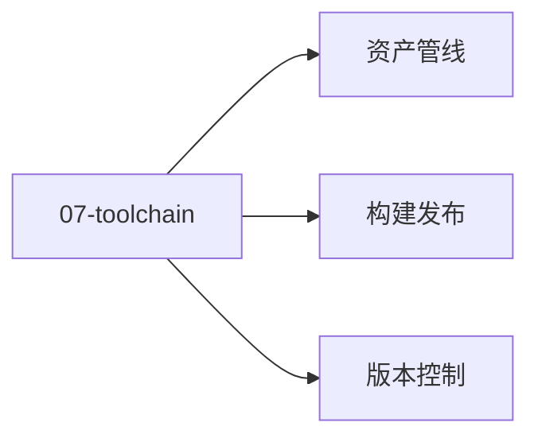

# 07 · 工具链

游戏工具链：资产 / 版本控制 / 构建发布。

## 章节目录

| 节点 | 一句话 |
|------|--------|
| [资产管线](./assets) | FBX / glTF / LOD / Addressable |
| [版本控制](./vcs) | Git LFS / Perforce / 分支 |
| [构建发布](./build) | 多平台构建 / CI/CD / Steam |

## 🎯 选型决策

- **小团队**：Git LFS
- **大团队**：Perforce Helix
- **构建**：GitHub Actions + Library 缓存

## 📚 学习路径

- **入门**：Git + Unity / UE 构建
- **进阶**：CI/CD + 资产压缩
- **高级**：主机 SDK 接入 + TRC 认证


## 📝 章节目录

[资产管线](./assets) / [版本控制](./vcs) / [构建发布](./build)

## 🛠️ 实战提示

资产膨胀是大型游戏最大痛点。

## 🔗 延伸阅读

- [GameDev.net](https://www.gamedev.net/)
- [GDC Vault](https://www.gdcvault.com/)
- [Unity Manual](https://docs.unity3d.com/Manual/index.html)
- [Unreal Engine Docs](https://docs.unrealengine.com/)

- **实战提示**：从引擎默认配置入手，按需自定义。
- **官方文档**：参考 Unity / Unreal / Godot 最新 LTS 版本。


<!-- auto-enrich:do-not-edit -->

## 实战示例

```bash
# TODO: 在此补充本页主题的实战命令
echo "hello"
```

```yaml
# TODO: 配置示例
key: value
```

## 进阶话题

> TODO: 此节可补充 3-5 段深度内容（如生产环境实战 / 常见错误 / 对比其他方案 / 未来演进）。

补充方向：
- 在生产环境如何配置 / 调优
- 与同类方案的对比（如 A vs B）
- 常见 3-5 个错误及排查
- 进阶阅读资料链接
<!-- auto-enrich:do-not-edit -->

## 🗺 章节目录图

<!-- mermaid-injected:do-not-edit -->


