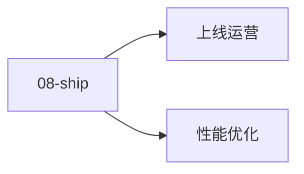

# 08 · 性能与上线

游戏性能与上线：性能 / 多平台 / 反作弊 / 数据。

## 章节目录

| 节点 | 一句话 |
|------|--------|
| [性能优化](./perf) | Draw Call / GC / 内存池 / 帧率 |
| [上线运营](./launch) | 多平台 / 认证 / 反作弊 / 埋点 |

## 🎯 选型决策

- **性能**：先 Profiler 后优化
- **上线**：数据驱动决策
- **合规**：隐私 + GDPR + 未成年保护

## 📚 学习路径

- **入门**：引擎 Profiler
- **进阶**：Frame Debugger + Memory Profiler
- **高级**：GPU 优化 + 数据埋点体系


## 📝 章节目录

[性能优化](./perf) / [上线运营](./launch)

## 🛠️ 实战提示

上线前必须做：性能 Profile + 反作弊 + 数据埋点。

## 🔗 延伸阅读

- [GameDev.net](https://www.gamedev.net/)
- [GDC Vault](https://www.gdcvault.com/)
- [Unity Manual](https://docs.unity3d.com/Manual/index.html)
- [Unreal Engine Docs](https://docs.unrealengine.com/)

- **实战提示**：从引擎默认配置入手，按需自定义。
- **官方文档**：参考 Unity / Unreal / Godot 最新 LTS 版本。


<!-- auto-enrich:do-not-edit -->

## 实战示例

```bash
# TODO: 在此补充本页主题的实战命令
echo "hello"
```

```yaml
# TODO: 配置示例
key: value
```

## 进阶话题

> TODO: 此节可补充 3-5 段深度内容（如生产环境实战 / 常见错误 / 对比其他方案 / 未来演进）。

补充方向：
- 在生产环境如何配置 / 调优
- 与同类方案的对比（如 A vs B）
- 常见 3-5 个错误及排查
- 进阶阅读资料链接
<!-- auto-enrich:do-not-edit -->

## 🗺 章节目录图

<!-- mermaid-injected:do-not-edit -->


