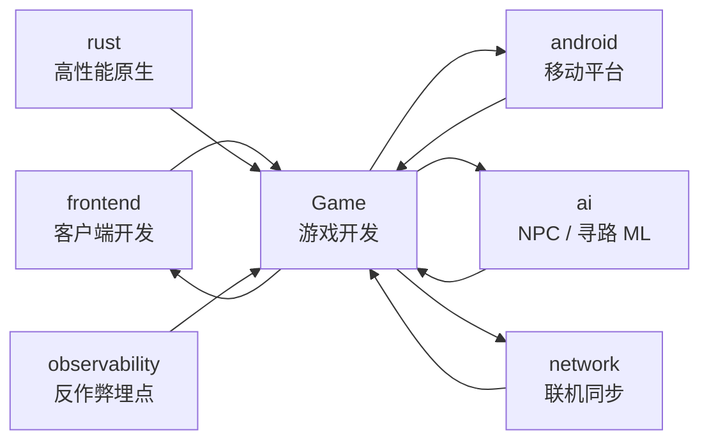
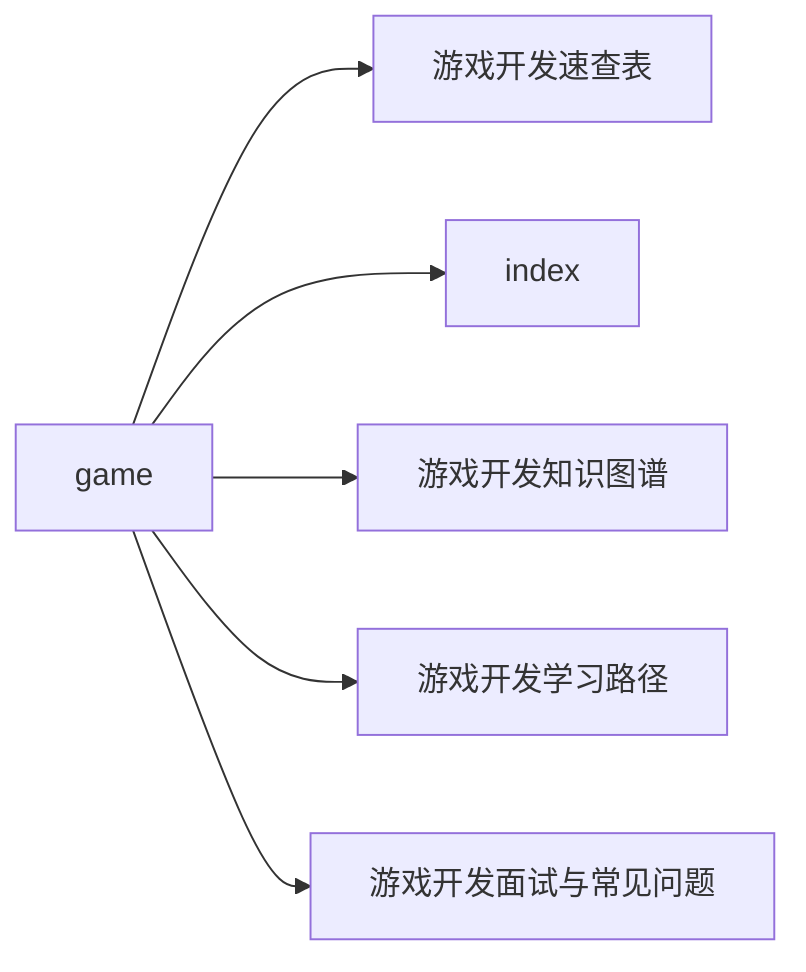

# Game 站在知识图谱中的位置

## 一句话定义

**Game = 基于实时渲染 + 物理模拟 + 多人同步的交互式内容工程**：引擎层（Unity / Unreal / Godot）+ 渲染管线（Forward / Deferred / Clustered）+ 物理（碰撞 / 刚体）+ AI（FSM / BT / GOAP）+ 网络（状态同步 / 帧同步）的横切栈。

## 在 31 站中的关系

## 上下游关系

### 上游（依赖什么）

- **frontend**：客户端通识（窗口 / 输入 / UI / 事件循环）
- **rust**（可选）：图形 / 引擎底层原生代码常用 Rust / C++
- **ai**：NPC 决策 / 强化学习 / 群体模拟
- **network**：联机同步 / KCP / 反外挂
- **android**：移动游戏上架 / 平台 SDK / 功耗优化

### 下游（被谁依赖）

- **frontend**：游戏前端是前端开发的延伸
- **observability**：玩家行为 / 性能埋点需要接入监控
- **security**（间接）：反作弊 / 反外挂 / 防破解属于安全延伸

## 与相邻站的边界

| 站 | 核心差异 | 交集 |
|---|---|---|
| frontend | 通用客户端开发 | 游戏前端 / UI 系统 |
| android | Android 移动平台 | 移动游戏 / Android SDK |
| rust | 系统语言 | 引擎底层 / 高性能模块 |
| ai | 通用 AI | NPC / 强化学习 / 寻路 |
| network | 通用网络 | 联机同步 / 反外挂 |
| observability | 通用监控 | 游戏埋点 / 性能采集 |

## 谁需要读 Game 站

- 想做独立游戏 / 业余项目的开发者
- 准备面试游戏客户端 / 渲染 / 引擎岗的候选人
- 已会前端 / 客户端，想拓展到游戏开发方向
- 网络 / AI 工程师想了解游戏领域的特殊应用

## 学习入口

- **5 分钟了解**：读 [index.md](./index)
- **看全局知识图谱**：[mindmap.md](./mindmap)
- **按背景选路径**：[path.md](./path)
- **面试 / 自测**：[questions.md](./questions)
- **API / 参数速查**：[cheatsheet.md](./cheatsheet)

## 当前文档范围

本页为 Game 站首版 v0.1，已覆盖：

- 引擎选型（Unity / Unreal / Godot 对比）
- 渲染管线（前向 / 延迟 / 光追）
- 物理（碰撞 / 刚体 / 布料）
- AI（寻路 / 行为树 / 决策）
- 网络（状态同步 / 帧同步 / 反外挂）
- 性能（Draw Call / GC / 帧率稳定）
- 工具链（资产管线 / 版本控制 / CI/CD）

后续版本将补充：完整示例代码（Unity C# / Unreal C++ / GDScript 三栈对照）、常用 Shader 模板库、性能调优 checklist。

## 章节快速导航

| 章节 | 内容 | 一句话 |
|---|---|---|
| [01 · 引擎层](./01-engine/) | 商业引擎 / 自研引擎 / 选型 | 引擎选型与架构 |
| [02 · 渲染](./02-render/) | 管线 / 光照 / 着色器 / 后处理 | 图形渲染技术栈 |
| [03 · 物理](./03-physics/) | 碰撞 / 刚体 / 柔体 | 物理模拟基础 |
| [04 · AI](./04-ai/) | 寻路 / 决策 / ML | NPC 智能化 |
| [05 · 网络](./05-network/) | 同步 / 一致性 / 反外挂 | 联机游戏核心 |
| [06 · 音频](./06-audio/) | 空间 / 混音 / 引擎 | 沉浸感设计 |
| [07 · 工具链](./07-toolchain/) | 资产 / VCS / 构建 | 工程化基础 |
| [08 · 性能与上线](./08-ship/) | 性能 / 多平台 / 运营 | 上线运营 |

## 🗺 章节目录图

<!-- mermaid-injected:do-not-edit -->

