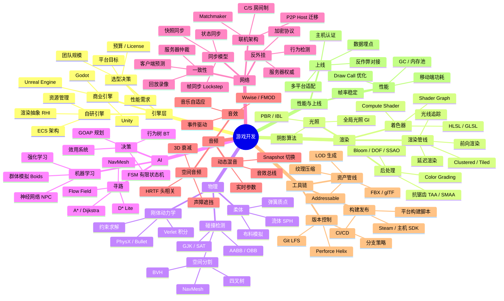

# 🗺️ 游戏开发知识图谱

> 本页用 Mermaid mindmap 展示游戏开发全栈知识结构。

## 阅读建议

- **引擎使用者**：从引擎选型 → 渲染管线 → 着色器 入手，掌握一个 DCC 工作流
- **图形程序员**：渲染管线 → 光照 → 着色器 → GPU 优化，最后补 Compute / 光追
- **AI / 网络程序员**：寻路 → 行为树 → 同步模型，重点掌握一致性和反外挂
- **工具链工程师**：资产管线 → 版本控制 → CI/CD，关注资产膨胀和构建时长

## 在图谱中的位置

游戏开发是 frontend（客户端开发延伸）+ rust（高性能原生）+ ai（NPC / 寻路）+ network（联机同步）的横切栈。客户端开发基础是底盘；想深入图形 / 引擎底层，建议补 rust + 数学（线性代数）；要做联机，必看 network + 反外挂。
