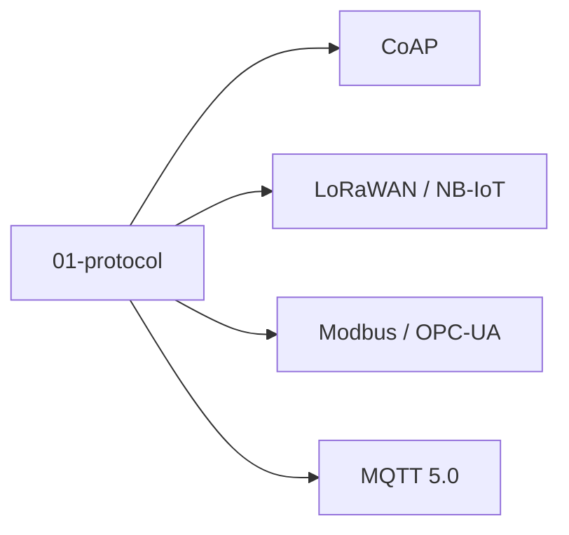

# 01 · 通信协议

IoT 设备互联的基础协议层。

## 章节目录

| 节点 | 一句话 |
|------|--------|
| [MQTT 5.0](./mqtt) | IoT 事实标准，发布订阅 |
| [CoAP](./coap) | 受限设备首选，UDP 上的 RESTful |
| [Modbus / OPC-UA](./modbus) | 工业现场总线 |
| [LoRaWAN / NB-IoT](./lpwan) | 低功耗广域网 |

## 选型决策

- **应用层协议**：MQTT（首选）/ CoAP（受限设备）/ HTTP（调试）
- **工业现场**：Modbus TCP（简单）/ OPC-UA（工业 4.0）
- **远距离低功耗**：LoRaWAN（免授权）/ NB-IoT（运营商）
## 🎯 选型决策树

设备选哪种通信协议？按三个维度判断：

1. **网络环境**：局域网（Modbus / OPC-UA）vs 互联网（MQTT / CoAP / HTTP）vs 远距离低功耗（LoRaWAN / NB-IoT）
2. **设备能力**：MCU 算力强（MQTT / HTTP）vs 资源受限（CoAP）
3. **应用需求**：发布订阅（MQTT）vs 请求响应（CoAP / HTTP）vs 工业控制（Modbus）

详细各协议对比见子节点文章。


<!-- auto-enrich:do-not-edit -->

## 实战示例

```bash
# TODO: 在此补充本页主题的实战命令
echo "hello"
```

```yaml
# TODO: 配置示例
key: value
```

## 进阶话题

> TODO: 此节可补充 3-5 段深度内容（如生产环境实战 / 常见错误 / 对比其他方案 / 未来演进）。

补充方向：
- 在生产环境如何配置 / 调优
- 与同类方案的对比（如 A vs B）
- 常见 3-5 个错误及排查
- 进阶阅读资料链接
<!-- auto-enrich:do-not-edit -->

## 🗺 章节目录图

<!-- mermaid-injected:do-not-edit -->


