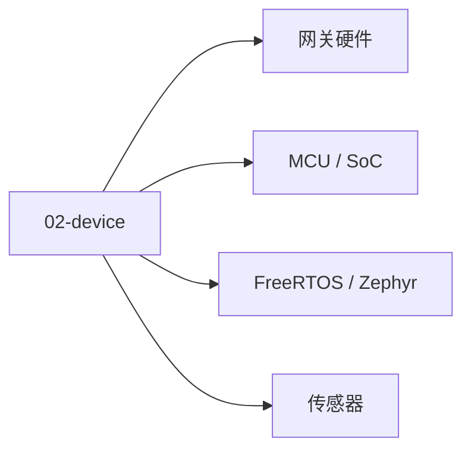

# 02 · 设备与硬件

IoT 终端的硬件选型与嵌入式开发。

## 章节目录

| 节点 | 一句话 |
|------|--------|
| [MCU / SoC](./mcu) | 微控制器与片上系统 |
| [FreeRTOS / Zephyr](./rtos) | 嵌入式实时操作系统 |
| [传感器](./sensor) | 温湿度 / IMU / 图像 / 气体 |
| [网关硬件](./gateway) | 树莓派 / 工业网关 / 边缘网关 |

## 选型思路

- 入门：ESP32 + Arduino
- 中端：STM32 + FreeRTOS
- 网关：树莓派 + K3s / EMQX
- 工业：研华 UNO + 西门子 IOT2050
## 🎯 选型三问

- **电池供电？** ESP32 / nRF52（低功耗）/ STM32L（低功耗系列）
- **实时性？** STM32 + FreeRTOS / Zephyr（硬实时）/ Linux Embedded（软实时）
- **需要哪些外设？** I2C / SPI / UART / ADC / PWM / 专用接口

**调试工具**：JTAG / SWD / 串口 / 逻辑分析仪。
**调试**：JTAG / SWD / 串口 / 逻辑分析仪
**功耗**：睡眠模式（μA 级）/ 工作模式（mA 级）/ 发射峰值（A 级）。

- **小贴士**：选型先看功耗预算（电池 vs 电源）、实时性、外设需求三件事。


<!-- auto-enrich:do-not-edit -->

## 实战示例

```bash
# TODO: 在此补充本页主题的实战命令
echo "hello"
```

```yaml
# TODO: 配置示例
key: value
```

## 进阶话题

> TODO: 此节可补充 3-5 段深度内容（如生产环境实战 / 常见错误 / 对比其他方案 / 未来演进）。

补充方向：
- 在生产环境如何配置 / 调优
- 与同类方案的对比（如 A vs B）
- 常见 3-5 个错误及排查
- 进阶阅读资料链接
<!-- auto-enrich:do-not-edit -->

## 🗺 章节目录图

<!-- mermaid-injected:do-not-edit -->


