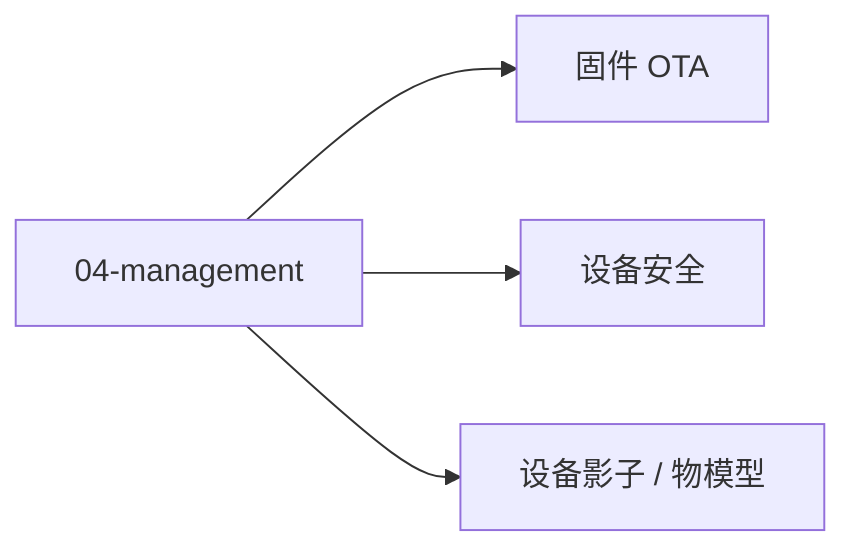

# 04 · 设备管理

设备全生命周期：注册 → 认证 → 配置 → 命令 → OTA。

## 章节目录

| 节点 | 一句话 |
|------|--------|
| [设备影子 / 物模型](./shadow) | 设备状态云端抽象 |
| [固件 OTA](./ota) | 空中升级与签名 |
| [设备安全](./security) | X.509 / mTLS / 密钥管理 |

## 安全四支柱

1. 证书（设备身份）
2. mTLS（双向认证）
3. 密钥管理（HSM / SE）
4. OTA 签名（固件防伪）
## 🎯 安全四支柱

1. **证书**：设备唯一身份（X.509）
2. **mTLS**：双向 TLS 认证
3. **密钥管理**：HSM / TrustZone / SE 芯片
4. **OTA 签名**：固件防伪
**生命周期**：注册 → 认证 → 配置 → 命令 → OTA
**运维**：监控设备在线率 / 心跳 / 消息延迟，告警阈值。

## 📚 学习路径

- **入门**：阿里云 LinkKit 物模型 + 自建 EMQX（设备影子练习）
- **进阶**：AWS IoT Core / Azure IoT Hub（完整云生态）
- **生产**：批量设备烧录证书 + OTA 灰度发布 + 监控设备在线率


<!-- auto-enrich:do-not-edit -->

## 实战示例

```bash
# TODO: 在此补充本页主题的实战命令
echo "hello"
```

```yaml
# TODO: 配置示例
key: value
```

## 进阶话题

> TODO: 此节可补充 3-5 段深度内容（如生产环境实战 / 常见错误 / 对比其他方案 / 未来演进）。

补充方向：
- 在生产环境如何配置 / 调优
- 与同类方案的对比（如 A vs B）
- 常见 3-5 个错误及排查
- 进阶阅读资料链接
<!-- auto-enrich:do-not-edit -->

## 🗺 章节目录图

<!-- mermaid-injected:do-not-edit -->


