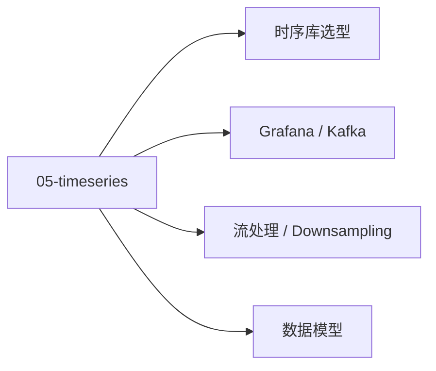

# 05 · 时序数据

IoT 数据的存储 / 处理 / 可视化。

## 章节目录

| 节点 | 一句话 |
|------|--------|
| [时序库选型](./database) | InfluxDB / TDengine / TimescaleDB |
| [流处理 / Downsampling](./processing) | 降采样 + 连续查询 |
| [Grafana / Kafka](./integration) | 可视化与消息集成 |
| [数据模型](./schema) | tag / field / timestamp |

## 典型架构

```
设备 → MQTT → Kafka → InfluxDB → Grafana
                  ↓
              Downsampling
                  ↓
              长期存储（聚合）
```
## 🎯 典型架构

```
设备 → MQTT → Kafka → InfluxDB → Grafana
                  ↓
              Downsampling
                  ↓
              长期存储（聚合）
```

- **写入层**：Kafka / EMQX（高吞吐）
- **存储层**：InfluxDB / TDengine（时序优化）
- **查询层**：Grafana / PromQL
**写优化**：批量写 + 预排序 + 压缩
**Schema 设计**：tag 维度要稳定，避免每条数据都有新 tag 值。

## 📚 学习路径

- **入门**：InfluxDB 单机 + Grafana（30 分钟跑通）
- **进阶**：TDengine 集群 + Kafka 流处理
- **生产**：考虑数据生命周期（原始 → 1m 聚合 → 1h 聚合 → 归档），按 7d / 30d / 365d 分级存储

- **小贴士**：Grafana 用 Flux / InfluxQL 查 InfluxDB，用 SQL 查 TDengine。

## 🗺 章节目录图

<!-- mermaid-injected:do-not-edit -->


