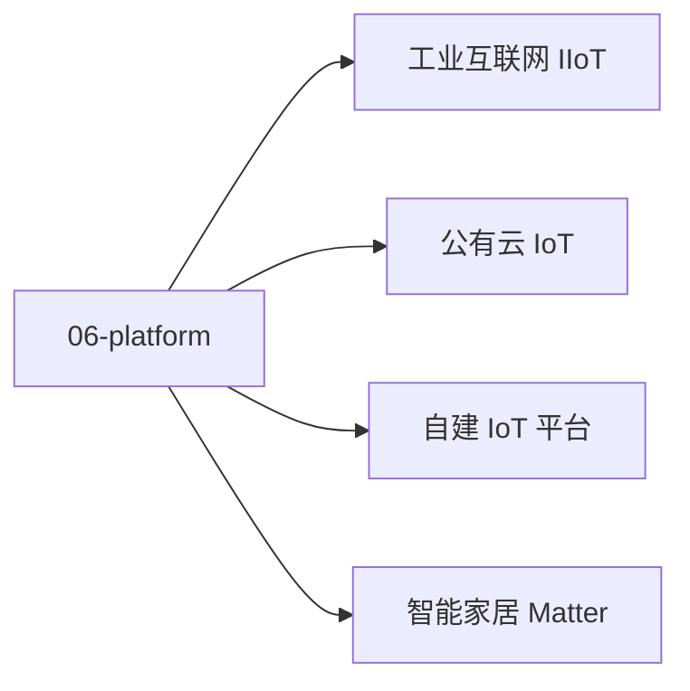

# 06 · 云平台与行业落地

公有云 IoT + 自建平台 + 行业方案。

## 章节目录

| 节点 | 一句话 |
|------|--------|
| [公有云 IoT](./public-cloud) | AWS / Azure / 阿里云 / 华为云 |
| [自建 IoT 平台](./self-hosted) | EMQX / ThingsBoard / HiveMQ |
| [智能家居 Matter](./smart-home) | 跨生态互联协议 |
| [工业互联网 IIoT](./iiot) | 工业 4.0 + 边缘计算 |

## 选型决策

- 公有云（运维省心 / 成本可控）：阿里云 / AWS
- 自建（数据自主 / 长期省钱）：EMQX + ThingsBoard
- 智能家居：Matter（跨生态）
- 工业场景：OPC-UA + IIoT 平台
## 🎯 选型决策

- **公有云**（运维省心 / 成本可控）：阿里云 / AWS / 华为云
- **自建**（数据自主 / 长期省钱）：EMQX + ThingsBoard
- **智能家居**：Matter（跨生态）
- **工业场景**：OPC-UA + IIoT 平台
**集成**：所有平台都支持 MQTT / Webhook
**协议**：所有平台都支持 MQTT + WebHook，集成成本低。


<!-- auto-enrich:do-not-edit -->

## 实战示例

```bash
# TODO: 在此补充本页主题的实战命令
echo "hello"
```

```yaml
# TODO: 配置示例
key: value
```

## 进阶话题

> TODO: 此节可补充 3-5 段深度内容（如生产环境实战 / 常见错误 / 对比其他方案 / 未来演进）。

补充方向：
- 在生产环境如何配置 / 调优
- 与同类方案的对比（如 A vs B）
- 常见 3-5 个错误及排查
- 进阶阅读资料链接
<!-- auto-enrich:do-not-edit -->

## 🗺 章节目录图

<!-- mermaid-injected:do-not-edit -->


