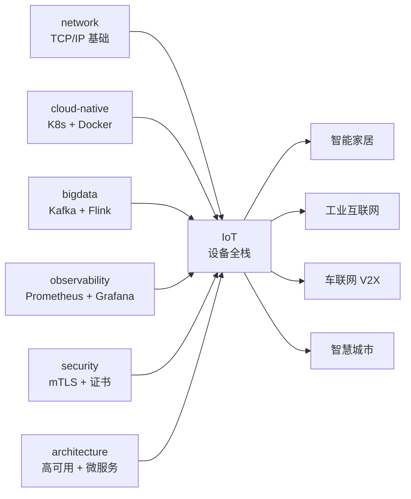
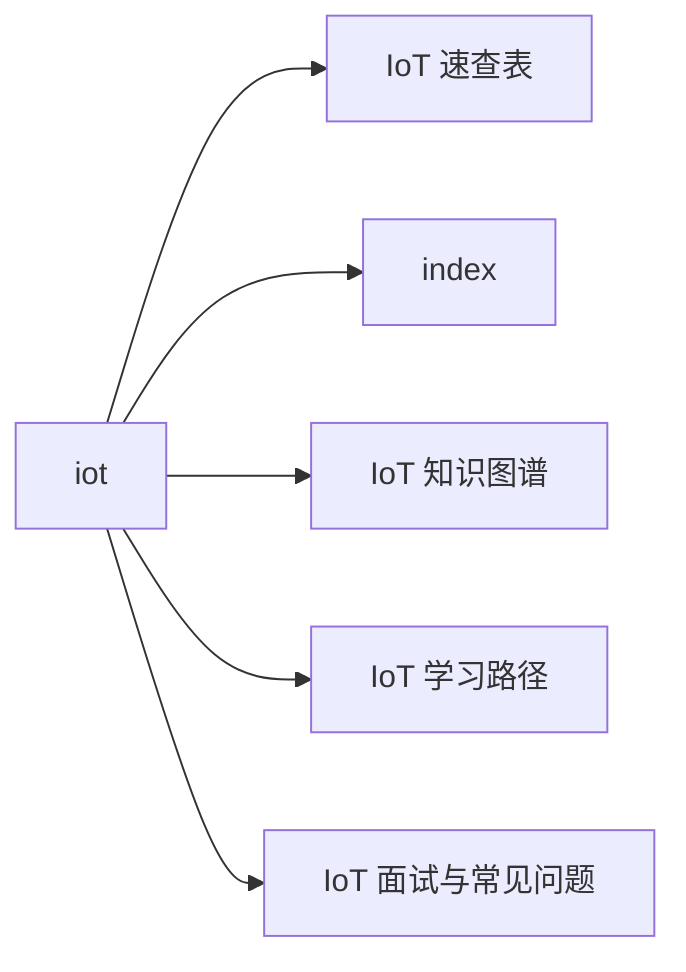

# IoT 站在知识图谱中的位置

## 一句话定义

**物联网（IoT）= 把物理世界的设备 / 传感器 / 执行器数字化并接入互联网**。它不是单一技术，而是协议、硬件、边缘、云端、行业落地的**横切层**。

## 在 28 站中的关系

## 关键 takeaway

- **IoT 是横切层，不是替代品**：学 IoT 前先补 network / cloud-native / bigdata 三门基础
- **协议不是越多越好**：90% 场景 MQTT 一招鲜；只在工业现场加 OPC-UA / ModBus
- **数据时序性是核心**：别用 MySQL，第一周就上 InfluxDB / TDengine
- **安全是后置必修**：先跑通再加 mTLS / 证书 / 签名，不要"以后再说"
- **云平台不是银弹**：百万级以下自建 EMQX 比上云便宜

## 与其他站点的关系

| 站点 | 关系 |
|---|---|
| network | MQTT 跑在 TCP/IP 上；5G / NB-IoT 是网络层技术 |
| cloud-native | KubeEdge / EdgeX 是 K8s 在边缘的延伸 |
| bigdata | 千万设备数据接入 Kafka / Flink 实时处理 |
| observability | 设备指标用 Prometheus remote_write 接入 |
| security | 设备证书 / mTLS / OTA 签名是 IoT 安全核心 |
| architecture | 千万级 IoT 平台是高可用 + 微服务架构 |
| postgresql | 设备元数据 / 影子存 PG（不是时序库） |
| redis | 设备影子 / 在线状态 / 限流热点数据 |

## 🗺 章节目录图

<!-- mermaid-injected:do-not-edit -->

<!-- svg-injected:do-not-edit -->

