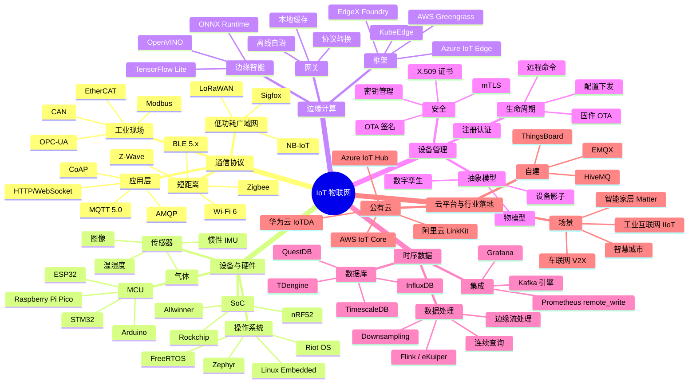

# 🗺️ IoT 知识图谱

> 本页用 Mermaid mindmap 展示 IoT 全栈知识结构。

## 阅读建议

- **协议入门**：先看 MQTT / CoAP 两节，再看 Modbus 对比
- **设备端**：从 ESP32 + FreeRTOS 入手，进阶到 Linux Embedded
- **边缘架构**：先看 EdgeX 整体框架，再深入 KubeEdge
- **数据落地**：协议 → 设备 → 边缘 → 云端 → 时序库 → 可视化是一条完整链路

## 在图谱中的位置

物联网是 **network（网络协议）+ cloud-native（容器化边缘）+ bigdata（时序数据）** 三大领域的交叉落地场景。如果只看图谱名词不熟悉，先回到 [network](/network/)/[cloud-native](/cloud-native/) 站补基础。
