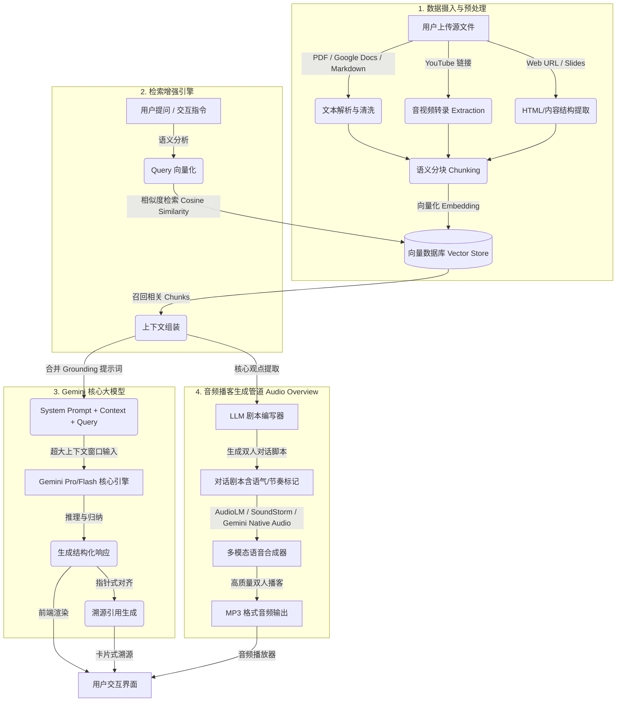

# Google NotebookLM 架构深度解析

Google **NotebookLM**（前身为 Project Tailwind）是 Google 推出的一款基于 **“源文件落地”（Source-Grounding）** 理念的个性化 AI 笔记本和研究助手。与传统的通用大语言模型（LLM）对话工具相比，NotebookLM 的核心设计目标是**只在用户上传的私有数据范围内进行理解、推理和创作**，从而极大地减少幻觉（Hallucinations），并提供精确到原文的引用（Citations）。

本报告将从数据摄入、RAG 检索、Gemini 核心模型、以及明星功能——音频播客（Audio Overview）等维度，为您深度剖析 NotebookLM 的系统架构。

---

## 1. 核心架构拓扑图

NotebookLM 的整体架构是一个典型的 **高级检索增强生成 (Advanced RAG)** 管道，并深度集成了多模态合成能力。



---

## 2. 核心技术组件解析

### 2.1 摄入与源文件接地 (Ingestion & Source Grounding)
NotebookLM 支持多元化的文件类型，包括 PDF、Google 文档、表格、幻灯片、网页链接和 YouTube 视频转录等。为了实现高精度的“源文件接地”，其摄入层进行了如下设计：

* **文档结构解析器 (Document Parser)**：将各种非结构化格式解析为纯文本，同时提取关键元数据（如段落位置、文件名、页码、视频时间戳等）。
* **智能语义分块 (Semantic Chunking)**：根据语意边界（而非硬性字数限制）进行分块，保证每一个 Chunk 都具备相对独立的语义信息，避免信息碎片化。
* **高维向量嵌入 (Vector Embeddings)**：将分块后的文本通过 Google 专有的 Embedding 模型转化为向量，并存储于高并发、低延迟的轻量级向量索引库中。

> [!IMPORTANT]
> **Source-Grounding 隔离机制：**  
> NotebookLM 的关键设计在于其“沙盒化”的知识边界。即使核心模型具备海量的预训练知识，系统也通过特殊的 System Instructions 限制模型只能使用检索召回的 Context 来回答，否则必须明确告知用户“源文件中未提及”。

---

### 2.2 检索增强生成 (RAG) 引擎
传统的 RAG 系统容易因为检索召回率低或检索出噪声而导致回答不准确。NotebookLM 针对性地优化了这一环节：

| 检索阶段 | 技术实现与优势 |
| :--- | :--- |
| **混合检索 (Hybrid Retrieval)** | 结合高维语义检索 (Dense Retrieval) 和关键词精确匹配 (Sparse Retrieval)，既能读懂用户的语义意图，又不会漏掉专业术语。 |
| **重排机制 (Reranking)** | 召回初步候选 Chunks 后，使用轻量级交叉编码器模型进行二次打分重排，只将最相关的 Top-K 信息输入给大模型。 |
| **超大上下文 (Long-context Window)** | 依托 Gemini 的原生百万级（甚至两百万级）上下文窗口，NotebookLM 在面临复杂跨文档查询时，可以直接将大量召回的原文完整作为上下文塞入 Prompt，从而避免了丢失微小细节的尴尬。 |

---

### 2.3 Gemini 核心大模型
NotebookLM 的智力核心源自 **Google Gemini** 模型家族（如 Gemini 1.5 Pro / Flash 或最新的 Gemini 3.5 版本）：

* **精准的指针式引用 (Pointer-based Citations)**：大模型在生成答案时，会输出带有特定标识的 Token（例如 `[source_1]`）。前端解析这些标识，将它们渲染为 clickable 的卡片，点击即可高亮定位到用户原文件的具体段落。这解决了大模型“无法溯源”的痛点。
* **原生多模态理解**：Gemini 能够直接读取图像、表格和音视频数据。例如，当用户提供 YouTube 链接时，NotebookLM 不仅能处理其字幕，还可以结合 Gemini 的视频帧理解能力（若启用）解析视频里的 PPT 画面。

---

## 3. 音频播客生成管道 (Audio Overview Architecture)

“音频播客”（Audio Overview）是 NotebookLM 的标志性创新功能。该模块的系统架构可分为以下几个阶段：

```
+------------------+     Gemini LLM     +----------------------+     AudioLM / SoundStorm     +------------------+
|  召回的源文件内容  |  -------------->  | 双人主播对话剧本生成   |  --------------------------> | 逼真多模态语音合成  |
| (Context & Core) | (Roleplay Script)  | (含停顿、语气、笑声) |  (Audio Synthesis Models)    | (播客 MP3 音频)  |
+------------------+                    +----------------------+                              +------------------+
```

1. **剧本编写器 (LLM Script Writer)**：
   * **输入**：用户上传的全部文档提炼出的核心主线、概念和矛盾冲突。
   * **角色扮演 Prompt**：系统给 LLM 下达“两位专业播客主持人（一男一女）”的设定，要求将干瘪的文档内容重塑为有张力、有互动、有隐喻的生动对话。
   * **剧本标记**：脚本中会带有丰富的副语言标记，如 `[pause]`（停顿）、`[laughter]`（笑声）、`[sigh]`（叹气）以及升降调指示。
2. **多模态语音合成器 (Speech Synthesis)**：
   * 区别于传统的单调 TTS (Text-to-Speech)，NotebookLM 背后依托 Google 的 **AudioLM** 和 **SoundStorm** 等尖端语音生成架构。
   * **生成机制**：它们不直接将文本转换为波形，而是将文本转化为**语义 Token (Semantic Tokens)**，再由声学模型渲染为**声学 Token (Acoustic Tokens)**。这使得生成的语音极其拟真，两位“主持人”不仅有自然的呼吸声、重音和口癖，还能相互打断、接梗或发出心领神会的笑声。

---

## 4. 智能体 (Agentic) 功能与安全隔离

为了实现更高级的推理，NotebookLM 正在引入“智能体（Agent）”架构：

* **代码执行沙盒 (Code Execution Sandbox)**：对于包含数学计算、数据分析的源文件，NotebookLM 会自动在后台的安全计算沙盒中编写并运行 Python 代码，将计算结果返回给大模型用于推理。
* **严格的隐私与安全边界**：
  * **数据不参与训练**：上传给 NotebookLM 的任何私有数据绝不会被用于训练 Google 的公共大模型。
  * **权限控制**：每个 Notebook 仅在用户的 Google 账号授权范围内可见，多租户逻辑严格隔离。

---

## 5. 总结与反思
通过这种基于“源文件接地”的沙盒架构设计，Google 成功将通用的多模态大模型转化为具备严谨检索和精准推理的个人知识库助手。这不仅极大降低了幻觉率，也为未来的个性化助理树立了架构典范。
