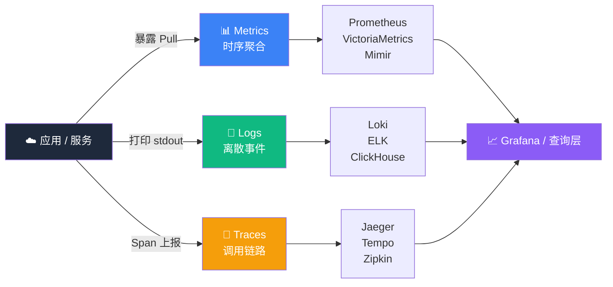

# 可观测性四大支柱


> **TL;DR**：四大支柱不是死规定，是经验总结。**Metrics 告诉你"是什么"，Logs 告诉你"发生了什么"，Traces 告诉你"经过了哪些节点"，Events 告诉你"什么时间发生了什么变更"**。四者关联，才是完整的可观测性。

## 一图看懂

```
                ┌──────────────────────────────────────┐
                │       可观测性 (Observability)        │
                └──────────────┬───────────────────────┘
                               │
        ┌──────────┬───────────┼───────────┬──────────┐
        ↓          ↓           ↓           ↓          ↓
    Metrics      Logs       Traces      Events    Profiles
    指标         日志        追踪         事件      剖析
        │          │           │           │          │
        ↓          ↓           ↓           ↓          ↓
    Prometheus   Loki       Jaeger     K8s Event  Pyroscope
    Mimir        ELK        Tempo      GitLab     pprof
    VictoriaM    ClickHouse Zipkin     ArgoCD     async-prof
```

> Profiles（剖析）有时作为第五支柱。它回答"**CPU / 内存具体花在哪些函数上**"，是性能调优的核武器。

## 三大信号关系图（Mermaid 版）



> 三大信号（Metrics / Logs / Traces）在生产环境通过 Grafana 等查询层关联，构成完整的"可观测性"视图。

## Metrics · 指标

**是什么**：数值型时间序列，每个数据点是一个 (timestamp, value, labels) 三元组。

**特点**：
- **存储成本低**：时序数据库压缩率 90%+
- **聚合友好**：可按任意维度求和 / 求平均
- **适合监控**：阈值告警、趋势分析
- **缺点**：丢失细节。看不到具体请求，只看到聚合数

**代表指标类型**：

| 类型 | 含义 | 例子 |
|---|---|---|
| Counter | 单调递增计数 | http_requests_total |
| Gauge | 可增可减瞬时值 | cpu_usage_percent |
| Histogram | 分布统计（桶） | http_request_duration_seconds_bucket |
| Summary | 分布统计（分位数） | rpc_duration_seconds{quantile="0.99"} |

**生态**：
- Prometheus / VictoriaMetrics / Mimir（CNCF）
- InfluxDB / TimescaleDB（传统时序）
- Datadog Metrics / NewRelic NRQL（商业）

## Logs · 日志

**是什么**：离散的事件记录，通常每行一条。

**特点**：
- **信息密度高**：包含完整上下文（错误堆栈、用户 ID、请求参数）
- **适合排障**：出问题第一件事就是看日志
- **缺点**：存储成本高，解析困难，无结构化字段难以检索

**日志级别**：

| 级别 | 用途 | 生产比例 |
|---|---|---|
| ERROR | 业务异常，需要关注 | < 1% |
| WARN  | 潜在问题 | ~ 5% |
| INFO  | 关键业务事件 | ~ 80% |
| DEBUG | 调试信息 | 开发期 |

**结构化 vs 非结构化**：

```json
// 结构化（推荐）
{
  "timestamp": "2026-08-09T15:30:00Z",
  "level": "ERROR",
  "service": "order-service",
  "trace_id": "abc123",
  "user_id": "u_456",
  "message": "Failed to process order",
  "error": "OutOfStock",
  "order_id": "o_789"
}

// 非结构化（不推荐）
2026-08-09 15:30:00 ERROR order-service: Failed to process order o_789 for user u_456, error=OutOfStock
```

> **黄金法则**：日志一定要带 `trace_id` 和 `user_id`，否则排障就是噩梦。

**生态**：
- ELK（Elasticsearch + Logstash + Kibana）
- EFK（Elasticsearch + Fluentd + Kibana）
- Loki + Promtail（Grafana 系）
- ClickHouse + Vector（新一代）

## Traces · 追踪

**是什么**：一次请求在分布式系统中的完整调用路径，由 Span 组成。

**核心概念**：

```
Trace（追踪）= 一次请求的完整故事
  └─ Span（跨度）= 一个工作单元
       ├─ Span A: 收到请求 30ms
       │    └─ Span B: 调用 Auth 服务 50ms
       │         └─ Span C: 验证 token 10ms
       └─ Span D: 调用 DB 80ms
```

**Span 属性**：
- `name`：`/api/orders POST`
- `start_time` / `duration`
- `trace_id`：全局唯一，关联所有 span
- `parent_span_id`：父子关系
- `attributes`：键值对（http.method, http.status_code, db.statement）
- `events`：span 内的事件（exception, log）
- `status`：OK / ERROR

**火焰图**：横轴是时间，纵轴是调用层级，红黄色块是热点。

**生态**：
- Jaeger（Uber 开源）
- Zipkin（Twitter 开源，老牌）
- Grafana Tempo（Grafana 系）
- SkyWalking（Apache，中国开源）
- OpenTelemetry Collector（统一采集）

## Events · 事件

**是什么**：业务事件或运维事件，离散发生，影响系统行为。

**特点**：
- 与日志的区别：日志是**结果**，事件是**变更**
- 与 trace 的区别：trace 是**请求链路**，事件是**业务动作**

**典型事件**：

| 类别 | 例子 |
|---|---|
| 部署事件 | 部署 v2.3.1 → order-service |
| 配置变更 | 调大 max_connections=1000 |
| 业务事件 | 双 11 大促开始、订单突破 100 万 |
| 告警事件 | Alertmanager 触发 P0 告警 |
| 安全事件 | 检测到异常登录 |

**生态**：
- K8s Event（kubectl get events）
- ArgoCD / Flux（GitOps 部署事件）
- GitLab CI / GitHub Actions（CI/CD 事件）
- 业务事件：自建 events table

**在 Grafana 上怎么用**：
```yaml
# 把事件叠加到时序图上
annotation:
  title: 部署 v2.3.1
  tags: [deploy, order-service]
  time: 2026-08-09T10:00:00Z
```

> **可观测性大杀器**：在大盘上叠加事件，可以看到"指标突变"是不是因为"刚发生了部署"。**没有事件的 Grafana 大盘，定位问题要慢 10 倍**。

## Profiles · 剖析（第五支柱）

**是什么**：程序运行时每一行代码占用的 CPU / 内存 / 锁时间。

**特点**：
- 回答"代码里哪个函数最耗 CPU"
- 持续剖析（Continuous Profiling）= 全天候低开销采样
- 火焰图：横轴是时间占比，纵轴是调用栈

**生态**：
- Pyroscope（Grafana 系，CNCF）
- Parca（CNCF）
- async-profiler（Java）
- pprof（Go 内置）
- Linux perf（系统级）

> **何时用**：CPU 飙高到 100% 但找不到原因，trace 看不出问题（trace 只看 latency 不看 CPU 占比）。这时上 profiling。

## 四支柱如何关联

### 核心思想：**用 trace_id 把三支柱串起来**

```
请求进入 → trace_id = abc123
   ↓
order-service: 输出 metrics（QPS +1, latency +=200ms）+ log（带 trace_id）+ span（order-service 200ms）
   ↓
payment-service: 同样输出 metrics + log（带 trace_id）+ span
   ↓
   出问题时：
   1. 看 metrics：哪个 service 的 latency 突增？
   2. 看 logs：过滤 trace_id = abc123 的 ERROR 日志
   3. 看 traces：trace_id = abc123 的完整链路
   4. 看 events：同一时段有没有部署/配置变更
```

### Grafana 关联示例

```yaml
# Loki 日志查询带 trace_id
{job="order-service"} |= "abc123"

# Tempo 追踪查询
traceId = "abc123"

# Prometheus 指标带 service 标签
histogram_quantile(0.99, sum(rate(http_request_duration_seconds_bucket{service="order-service"}[5m])) by (le))
```

> 三者**通过 trace_id 关联**，可在 Grafana 里一键跳转。**这是现代可观测性的精髓**。

## 选型决策树

```
问 1：你的服务数量？
├─ < 5 个 → Metrics + Logs 足够，加 Tracing 锦上添花
├─ 5-50 个 → + Tracing（必须）
└─ > 50 个 → + Profiling（定位热点）+ Events（关联变更）

问 2：你的预算？
├─ 0 → 全 OSS（Prometheus + Loki + Tempo + Grafana）
├─ 中 → OSS 核心 + 1 个商业 SaaS（如 Better Uptime）
└─ 高 → 全商业（Datadog / Dynatrace / NewRelic）

问 3：你的团队规模？
├─ < 5 人 → 别选 ELK，运维成本太高；选 Loki
├─ 5-20 人 → Prometheus + Loki + Tempo 全家桶
└─ > 20 人 → + Pyroscope + On-call 平台
```

## 一句话总结

> **没有银弹，没有"必须用哪四个支柱"。**
> 起步用 Metrics + Logs，进阶加 Traces，高阶加 Profiling + Events。**关键是用 trace_id 把它们串起来**。

---

🏠 <a href="https://java-px.bot.cd/" target="_blank">返回门户首页</a>

## 🔗 相关阅读（跨站导航）

<!-- xlink-subpage-injected:do-not-edit -->

本页相关主题的跨站入口:

- [devops](https://java-px.bot.cd/devops/):DevOps 监控
- [cloud-native](https://java-px.bot.cd/cloud-native/):K8s 监控
- [kafka](https://java-px.bot.cd/kafka/):日志收集
