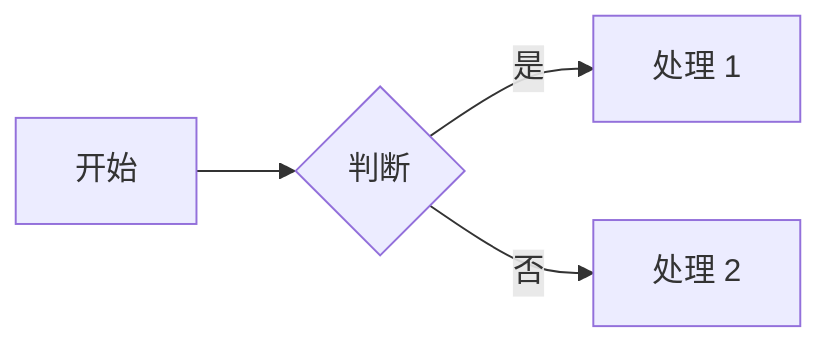

# §8.65 低完整度页补全模板

> 配套 `enrich-suggestions.md` 使用。
> 这些模板是"骨架"，不是完整内容。作者应按本页主题填充具体例子 / 参数 / 链接。

## 1. 缺代码块（` ``` `）

在页末加：

```markdown
## 实战示例

\`\`\`bash
# TODO: 在此补充本页主题的实战命令
echo "hello"
\`\`\`

\`\`\`yaml
# TODO: 配置示例
key: value
\`\`\`
```

## 2. 缺表格（`| --- |`）

在页末加：

```markdown
## 参数说明

| 参数 | 说明 | 默认值 |
| --- | --- | --- |
| TODO_1 | 待补充 | - |
| TODO_2 | 待补充 | - |
```

或对比表：

```markdown
## 方案对比

| 方案 | 优点 | 缺点 | 适用场景 |
| --- | --- | --- | --- |
| TODO | 待补充 | 待补充 | 待补充 |
```

## 3. 缺内链（非 http 链接）

在页末加：

```markdown
## 相关阅读

- [同站相关页面](./related-topic.md)
- [进阶话题](./advanced.md)
- [本站在知识图谱中的位置](./graph)
```

也可在正文中加内链：
```markdown
详细可参考 [配置说明](./config) 和 [常见错误](./errors)。
```

## 4. 缺字数 ≥ 500

扩写方向（任选 2-3 条）：

- **实战案例**：加 1 段"在生产环境如何使用"的描述
- **对比**：加 1 张对比表（其他方案 vs 本方案）
- **进阶话题**：加 1 节"## 进阶"覆盖深度内容
- **常见错误**：加 1 节"## 常见错误"列 3-5 个坑
- **延伸阅读**：加 3-5 个真实链接到权威资料

## 5. 缺 Mermaid 图

如果本页讲的是"流程 / 状态 / 关系"，加：



注意：本功能依赖 `vitepress-plugin-mermaid` 已配置（`MERMAID_SITES` 集合包含本站 site_id 时才会渲染）。

## 6. 缺 Vue 组件

本站通常用以下组件（如果适用）：
- `<WhyThisGraph />`：可视化"为什么写这个图谱"
- `<SiteMap />`：本站在知识图谱中的位置

## 7. 缺 frontmatter

每页必须有：

```markdown
---
title: 本页标题
description: 一句话描述
---
```

## 批量执行建议

1. **优先 score ≤ 1 的页**（最不完整）
2. **每次只补 1 个维度**（不要一次性大改）
3. **加占位 H2 时附 TODO 标记**（避免被当成已完成内容）
4. **commit 后跑 audit 验证 score 提升**
