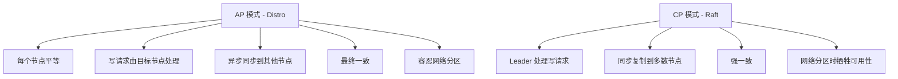
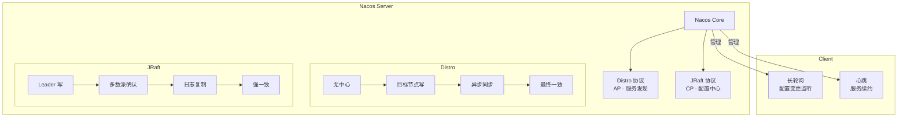

# ⚡ Nacos 底层原理

> Nacos 同时作为**服务发现**和**配置中心**，在底层采用了**两套不同的一致性协议**：
> - **服务发现** → **Distro 协议**（AP，最终一致）
> - **配置中心** → **JRaft 协议**（CP，强一致）
>
> 理解这些底层机制，才能真正掌握 Nacos 的架构设计。

## 🏗️ 整体架构

### 部署架构

```
┌──────────────────────────────────────────────────────────┐
│                    Nacos 集群 (3节点)                      │
│  ┌─────────────────┐  ┌─────────────────┐  ┌───────────┐│
│  │   Nacos Node 1  │  │   Nacos Node 2  │  │  Node 3   ││
│  │   Distro / Raft │◄─►  Distro / Raft  │◄─►  Distro   ││
│  │   Config / Naming│  │  Config / Naming│  │  / Raft   ││
│  └─────────────────┘  └─────────────────┘  └───────────┘│
│            │                     │             │          │
└────────────┼─────────────────────┼─────────────┘          │
             │                     │                         │
    ┌────────▼─────────┐   ┌──────▼───────────┐             │
    │  Service Client  │   │  Config Client   │             │
    │  (服务实例)       │   │  (微服务应用)     │             │
    └──────────────────┘   └──────────────────┘             │
```

### 核心模块

| 模块 | 职责 | 一致性协议 |
|------|------|-----------|
| **Naming** | 服务注册与发现、健康检查 | **Distro**（AP） |
| **Config** | 配置存储、变更推送 | **JRaft**（CP） |
| **Distro** | AP 模式下节点间数据同步 | Distro 自定义协议 |
| **JRaft** | CP 模式下元数据一致性 | Raft 算法实现 |
| **Nacos-Core** | 集群选主、节点管理 | 依赖 JRaft |

### 重要概念

```
Nacos 节点角色（CP 模式下的 Raft）:
┌────────────────┐
│   Leader       │  ← 负责写请求处理、日志复制
├────────────────┤
│   Follower     │  ← 负责读请求、转发写请求
├────────────────┤
│   Candidate    │  ← 选举时的临时角色
└────────────────┘

AP 模式下：
┌────────────────┐
│   Distro Node  │  ← 每个节点平等，无主从之分
│   (所有节点)    │     每个节点负责一部分数据的同步
└────────────────┘
```

## 🔄 AP vs CP：模式切换

### 切换配置

```properties
# Nacos Server application.properties
# AP 模式（默认）：服务注册发现使用
nacos.ap.query.only=false

# CP 模式：配置中心元数据使用
# 通过 Internal API 自动切换，无需手动配置
```

### 什么时候用 AP，什么时候用 CP？

```
服务注册发现 → AP（Distro）
  - 可用性优先：注册不可用比查询不可用更严重
  - 最终一致性：短暂读到过时实例列表没问题
  - 自动剔除不健康实例

配置中心 → CP（JRaft）
  - 一致性优先：配置不能不一致
  - 强一致性：所有客户端读到相同的配置值
  - 写入成功必须同步到多数节点

元数据管理 → CP（JRaft）
  - Namespace、Group 等元数据变更
  - 写操作频率低，一致性要求高
```

### 核心区别



## 🔬 Distro 协议（AP 模式）

> Distro 是 Nacos **自研**的一致性协议，专为服务注册发现场景设计，是 Nacos 区别于 Eureka、Consul 的核心创新。

### 设计思想

```
Distro = 无中心 + 最终一致 + 任务分发
```

### Distro 通信流程

```
服务提供方注册 order-service:8081
     │
     ▼
Nacos Node 1（目标节点，负责该实例）
     │
     ├─ 1. 写入本地注册表
     │     └─ ConcurrentHashMap 存储
     │
     ├─ 2. 异步同步到其他节点
     │     ├─ Nacos Node 2 ── 写入本地注册表
     │     └─ Nacos Node 3 ── 写入本地注册表
     │
     └─ 3. 返回注册成功（不等同步完成）
```

### 关键数据结构

```java
// Nacos 服务端核心数据结构
public class Service {
    // 服务名 -> 实例列表
    private Map<String, Instance> ipMap;
    
    // 负责该服务的 Distro 节点
    private String responsibleNode;
    
    // 最后更新时间
    private long lastUpdateTime;
    
    // 版本号（用于一致性校验）
    private long revision;
}
```

### 同步机制

```
定时同步（默认 5s）:
  ┌──────────┐         ┌──────────┐
  │ Node 1   ├────────►│ Node 2   │  HTTP POST /distro/datum
  │ (源节点)  │         │ (目标节点)│
  └──────────┘         └──────────┘

同步内容：
  - 变更的服务列表
  - 版本号（revision）
  - 时间戳

一致性检查：
  - 节点间定期校验 checksum
  - checksum 不一致则全量同步
```

### 健康检查与故障转移

```
客户端心跳 ──5s──► Node 1
                        │
  ┌─────────────────────┤
  ▼                     ▼
健康                 不健康（15s 超时）
 │                      │
 ├─ 保持在线            ├─ 标记为不健康（不删除）
 │                      │
 └─ 自动续签            └─ 客户端切换节点（重试机制）

节点宕机恢复：
  Node 1 宕机 → Node 2 接管 Node 1 负责的服务
  Node 1 恢复 → 从其他节点全量同步
```

### Distro 总结

```
✅ 优势：
  - 无中心，避免单点瓶颈
  - 写操作在目标节点完成，延迟低
  - 可水平扩展，支持 10 万级实例
  - 网络分区可用性不受影响

⚠️ 局限：
  - 最终一致，短暂过期读取
  - 节点间数据量大会有同步压力
  - 写操作集中到某节点时可能热点
```

## ⛓️ JRaft 协议（CP 模式）

> Nacos 的配置中心采用 **JRaft**（Java 实现的 Raft 算法）保证强一致性。JRaft 是蚂蚁金服开源的 Raft 实现，也是 SofaJRaft 的核心组件。

### Raft 核心过程

```
1. Leader 选举
   ┌────────┐    ┌────────┐    ┌────────┐
   │ Node 1 │    │ Node 2 │    │ Node 3 │
   │ Follower│   │ Follower│   │ Follower│
   └────────┘    └────────┘    └────────┘
                     │
             选举超时，成为 Candidate
                     │
                     ▼
   ┌────────┐    ┌────────┐    ┌────────┐
   │ Node 1 │    │ Node 2 │    │ Node 3 │
   │ Follower│◄───│Candidate│──►│Follower│
   │ (投票) │    │(请求投票)│   │ (投票) │
   └────────┘    └────────┘    └────────┘
                     │
             获得多数选票，成为 Leader
                     │
                     ▼
   ┌────────┐    ┌────────┐    ┌────────┐
   │ Node 1 │    │ Node 2 │    │ Node 3 │
   │ Follower│◄───│ Leader │──►│Follower│
   │ (心跳) │    │(心跳)   │   │ (心跳) │
   └────────┘    └────────┘    └────────┘

2. 日志复制
   ┌────────┐    ┌────────┐    ┌────────┐
   │ Node 1 │    │ Node 2 │    │ Node 3 │
   │   │    │    │ 写请求  │    │   │    │
   │   │    │    │   │     │    │   │    │
   │   │◄───┤    │ 追加日志│    │◄──┤    │
   │   │    │    │   │     │    │   │    │
   │   │◄───┤    │ 同步日志│───►│   │    │
   │   │    │    │   │     │    │   │    │
   │   │    │    │ 提交+应用│   │   │    │
   └────────┘    └────────┘    └────────┘
```

### 配置变更的完整流程

```
1. 管理员在控制台修改配置
   ┌────────────┐
   │ Nacos 控制台│──► HTTP PUT /nacos/v1/cs/config
   └────────────┘
        │
        ▼
   ┌────────────┐
   │ Nacos Node │── 通过 JRaft 路由到 Leader 节点
   └────────────┘
        │
        ▼
   ┌─────────────────────────────────────┐
   │         Raft Leader Node            │
   │                                     │
   │ 1. 写入 WAL（Write-Ahead Log）       │
   │ 2. 并行复制到 Follower 节点          │
   │ 3. 等待多数节点 ack                  │
   │ 4. Commit（提交到状态机）             │
   │ 5. 返回成功给客户端                   │
   └─────────────────────────────────────┘
        │
        ▼
   ┌─────────────────────────────────────┐
   │        推送配置变更到客户端            │
   │                                     │
   │ 1. 更新本地配置缓存                   │
   │ 2. 通知长轮询连接（Long Polling）      │
   │ 3. 客户端收到变更通知                  │
   │ 4. 客户端拉取最新配置                  │
   └─────────────────────────────────────┘
```

### 选主配置

```properties
# Nacos JRaft 配置
# 选举超时（毫秒）
com.alibaba.nacos.core.distro.election.timeout=3000

# 心跳间隔（毫秒）
com.alibaba.nacos.core.distro.heartbeat.interval=500

# 快照间隔（日志压缩）
com.alibaba.nacos.core.distro.snapshot.interval=3600
```

### JRaft 日志复制

```
Term 1: [Log 1] [Log 2]          ← Leader Node 2
Term 1: [Log 1] [Log 2]          ← Follower Node 1
Term 1: [Log 1]                  ← Follower Node 3（落后）

发现落后 → 日志追赶（InstallSnapshot）
     │
     ▼
Node 3 从 Leader 获取快照，追赶日志
```

## 📡 客户端长轮询（Long Polling）

> Nacos 配置中心的**实时推送**能力，靠的不是 Server Push，而是 **长轮询（Long Polling）**。

### 长轮询 vs 短轮询 vs WebSocket

| 方式 | 原理 | 实时性 | 服务端压力 | 实现难度 |
|------|------|--------|-----------|---------|
| **短轮询** | 客户端每隔 N 秒请求一次 | 低（取决于间隔） | 高（大量无效请求） | 简单 |
| **长轮询** | 客户端连接挂起，有变更才返回 | **高（准实时）** | 低（连接空闲等待） | 中等 |
| **WebSocket** | 全双工通信 | 最高 | 低 | 复杂 |

### Nacos 长轮询机制

```
┌────────────────────┐          ┌──────────────────┐
│   Config Client    │          │   Nacos Server    │
│   (order-service)  │          │                   │
└────────┬───────────┘          └────────┬──────────┘
         │                               │
         │  1. GET /v1/cs/configs        │
         │     ?dataId=order.yaml        │
         │     &group=DEFAULT_GROUP      │
         │     &contentMD5=xxxxx         │
         │──────────────────────────────►│
         │                               │
         │  2. 服务端检查 MD5            │
         │  比较：请求的 MD5 == 当前 MD5 │
         │                               │
         │     ┌─────────────────┐       │
         │     │  MD5 相同       │       │
         │     │  ➡ 等待 30s     │       │
         │     │  有变更时提前返回│       │
         │     └─────────────────┘       │
         │                               │
         │  ─ ─ ─ 30s 超时或无变更 ─ ─   │
         │◄──────────────────────────────│
         │    304 Not Modified           │
         │                               │
         │  ─ ─ ─ 配置发生变更 ─ ─ ─ ─   │
         │◄──────────────────────────────│
         │    200 OK + 新配置内容        │
         │                               │
         │  3. 客户端更新本地缓存         │
         │  立即发起下一次长轮询          │
         │──────────────────────────────►│
```

### 服务端实现要点

```java
// 伪代码：Nacos 长轮询服务端逻辑
public class LongPollingService {
    
    // 挂起的请求队列
    private final Queue<PollingRequest> suspendedRequests;
    
    // 处理拉取请求
    public void handlePolling(PollingRequest request) {
        // 1. 比较 MD5
        if (md5Matches(request)) {
            // 2. MD5 相同 → 挂起请求（默认 30s 超时）
            suspendRequest(request, 30_000);
            return;
        }
        // 3. MD5 不同 → 立即返回最新配置
        return latestConfig(request);
    }
    
    // 配置变更时被调用
    public void onConfigChange(String dataId) {
        // 找到匹配的挂起请求
        List<PollingRequest> matched = 
            findMatchedRequests(dataId);
        // 唤醒这些请求，立即返回新配置
        matched.forEach(req -> req.complete(latestConfig(req)));
    }
}
```

### 客户端实现要点

```java
// 伪代码：Nacos 客户端长轮询
public class ConfigWorker {
    
    public void startLongPolling() {
        ScheduledExecutorService executor = 
            Executors.newSingleThreadScheduledExecutor();
        
        executor.execute(() -> {
            while (true) {
                try {
                    // 发起长轮询请求（30s 超时）
                    ConfigResponse resp = 
                        pollConfig(dataId, group, md5, 30_000);
                    
                    if (resp.isChanged()) {
                        // 配置已变更 → 刷新本地缓存
                        refreshLocalConfig(resp.getContent());
                        // 触发 @RefreshScope 回调
                        publishRefreshEvent();
                    }
                } catch (TimeoutException e) {
                    // 30s 无变更超时 → 重新轮询
                    continue;
                }
            }
        });
    }
}
```

### 长轮询优化

```
批量查询：
  ┌─────────────────┐
  │     Client      │
  ├─────────────────┤
  │ order.yaml     │────┐
  │ common.yaml    │    │  一次请求监听多个配置
  │ redis.yaml     │◄───┘
  └─────────────────┘

示例：
  GET /v1/cs/configs/list?dataIds=order.yaml,common.yaml,redis.yaml

MD5 值比较（避免传输全量配置）：
  请求：dataId + group + md5
  响应：只有 MD5 不匹配时才返回全量配置
```

## ❤️ 健康检查机制

### 三种健康检查方式

```
1. 客户端心跳（默认，AP 模式）
   ┌──────────┐    每 5s     ┌──────────┐
   │  实例    ├─────────────►│ Nacos    │
   │  服务    │  heartBeat   │  服务端   │
   └──────────┘             └──────────┘
   
   超过 15s 无心跳 → 标记为不健康
   超过 30s 无心跳 → 实例被剔除

2. 服务端主动探测（TCP/HTTP）
   ┌──────────┐    探测       ┌──────────┐
   │ Nacos    ├─────────────►│  实例    │
   │  服务端   │ TCP:port    │  服务    │
   └──────────┘  HTTP:/health└──────────┘

3. gRPC 双向流（Nacos 2.x 新增）
   ┌──────────┐  gRPC Stream  ┌──────────┐
   │  实例    ├══════════════►│ Nacos    │
   │  服务    │  流式心跳     │  服务端   │
   └──────────┘             └──────────┘
   ✅ 连接复用，性能更好
   ✅ 双向通信，支持服务端主动推送
```

### 健康检查配置

```yaml
spring:
  cloud:
    nacos:
      discovery:
        # 心跳间隔（毫秒，默认 5000）
        heart-beat-interval: 5000
        # 心跳超时（毫秒，默认 15000）
        heart-beat-timeout: 15000
        # 实例删除超时（毫秒，默认 30000）
        ip-delete-timeout: 30000
        # 非持久化实例
        ephemeral: true
```

### 心跳流程图

```
    时间线
       │
   0s  │ 实例启动 → 注册到 Nacos
       │
   5s  │ 心跳 ──► Nacos（续约）
       │
  10s  │ 心跳 ──► Nacos（续约）
       │
  15s  │ ❌ 实例宕机，心跳停止
       │
  20s  │ Nacos 未收到心跳
       │
  30s  │ Nacos 标记实例"不健康"
       │    └─ 仍保留在服务列表中
       │
  45s  │ Nacos 实例超时 → 剔除
       │    └─ 从服务列表删除
```

## 🧩 集群节点间数据同步

### 同步策略对比

| 维度 | Distro 协议（AP） | JRaft 协议（CP） |
|------|------------------|----------------|
| **同步方式** | 异步 | 同步（多数节点） |
| **一致性** | 最终一致 | 强一致 |
| **写负载** | 目标节点处理 | Leader 节点处理 |
| **读负载** | 任意节点 | 任意节点 |
| **网络分区** | 每个分区可用 | 多数节点分区可用 |
| **性能** | 高（异步） | 中（需多数派确认） |

### 节点间通信

```
AP 模式（Distro）：
  HTTP POST /nacos/v1/ns/distro/datum
    请求体：JSON 序列化的服务实例数据

CP 模式（JRaft）：
  RPC 协议（基于 Netty + Protobuf）
    内部日志复制、心跳、投票
```

### 节点启动时的数据恢复

```
新节点加入集群：
  1. 向集群注册自己
  2. 从任意节点全量拉取 AP 数据（服务注册表）
  3. 通过 JRaft 恢复 CP 数据（配置元数据）
  4. 加入 Distro 同步轮次
  5. 开始对外提供服务

节点宕机恢复：
  1. 从磁盘加载快照
  2. 追赶宕机期间的增量日志
  3. 恢复服务注册表
  4. 重新加入集群
```

## 📊 总结：Nacos 底层原理全景图



### 高频面试题

> **Q：Nacos 为什么服务发现用 AP，配置中心用 CP？**
>
> A：服务发现要求高可用——注册不上比读到过时数据更严重。短暂读到已下线的实例，调用方会重试或走故障转移。配置中心则必须强一致——同一个服务的不同实例绝对不能读到不同的配置值，否则会出现数据不一致的严重故障。

> **Q：Nacos 的 Distro 协议和 Eureka 有什么区别？**
>
> A：两者都是 AP 协议，但 Nacos 的 Distro 设计了**目标节点负责制**——每个服务实例由其目标节点负责同步，减少了广播风暴。同时 Nacos 支持 AP/CP 动态切换，Eureka 固定为 AP。

> **Q：长轮询和 Server Push 的区别？**
>
> A：长轮询本质还是客户端主动拉取，但连接始终保留，服务端有变更时立即响应。真正的 Server Push（如 gRPC Stream）需要双向流，实现更复杂。Nacos 2.x 新增了 gRPC 双向流支持，但长轮询仍是主要的容灾兜底方案。

## 🔗 相关阅读（跨站导航）

<!-- xlink-subpage-injected:do-not-edit -->

本页相关主题的跨站入口:

- [architecture](https://java-px.bot.cd/architecture/):微服务架构
- [system-design](https://java-px.bot.cd/system-design/):系统设计
- [cloud-native](https://java-px.bot.cd/cloud-native/):Docker / K8s 落地
