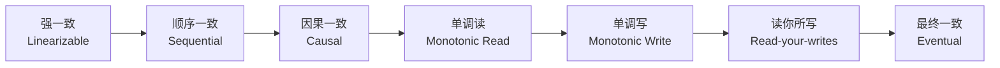

# 一致性与系统模型（Overview）


> 本章是系统设计全站的**索引页**。如果你只读一章，从这里开始。

## 1. 我们在讨论什么？

分布式系统讨论的核心问题：**多个节点在不可靠网络上如何就某个值达成一致**。

围绕这个核心问题，衍生出：

```
                分布式系统的核心问题
                       │
       ┌───────────────┼───────────────┐
       │               │               │
   一致性模型       共识算法         分布式事务
  （是什么？）     （怎么达成？）    （失败了怎么办？）
       │               │               │
   - 强一致         - Paxos          - 2PC / 3PC
   - 弱一致         - Raft           - TCC
   - 最终一致       - ZAB            - Saga
   - 因果一致       - Quorum         - 本地消息表
   - 读写一致                         - 事务消息
   - 单调读
   - 单调写
```

## 2. 一致性级别谱

从强到弱排列：



### 2.1 强一致（Linearizability）

> 所有操作看起来像是**按某种全局顺序**依次执行的，且顺序与真实时间一致。

**代价**：延迟极高。需要多数派确认才返回。

**典型系统**：Google Spanner、etcd（Linearizable read）、ZooKeeper sync 写。

### 2.2 顺序一致（Sequential Consistency）

> 所有操作看起来像是按某种全局顺序执行，但**不要求与真实时间一致**。

**区别于强一致**：节点 A 在 t1 写入，节点 B 在 t1+1ns 写入，强一致要求所有节点看到 A 在 B 前；顺序一致只要求所有节点看到同一顺序，可以 B 在 A 前。

**典型系统**：分布式共享内存、部分分布式 KV。

### 2.3 因果一致（Causal Consistency）

> 有因果关系的操作必须有序，无因果关系的可以乱序。

**例子**：
- 朋友圈：A 发帖 → B 评论 → C 评论。A 的发帖和 B/C 的评论有因果关系（B/C 必须看到 A 的帖）。但 C 看的广告推送和 A 的发帖无因果，可以乱序。

**典型系统**：COPS、EcoStore。

### 2.4 读你所写一致性（Read-your-writes）

> 写入者读自己的写时一定能看到。其他人是否能看到不保证。

**实现**：写入路由到主节点，读取也走主节点（sticky session）。

### 2.5 单调读（Monotonic Read）

> 客户端读过的值，**不会回退**。

**实现**：客户端 session 与特定副本绑定。

### 2.6 最终一致（Eventual Consistency）

> 没有新写入时，最终所有副本会收敛到同一值。但中间状态可能读到旧值。

**典型系统**：DNS、CDN、Redis 异步复制、S3、DynamoDB 默认。

## 3. 系统模型

### 3.1 网络模型

| 模型 | 假设 | 现实 |
|---|---|---|
| 同步模型 | 消息延迟有上界 | ❌ 不存在 |
| 半同步模型 | 消息延迟有上界但可能偶尔超时 | ⚠️ 接近现实但难实现 |
| 异步模型 | 消息可能丢失、延迟任意 | ✅ 真实互联网 |

> **结论**：真实系统是异步的。**FLP 不可能**（见后续章节）说明：异步模型 + 哪怕 1 个节点故障 → 不存在永远终止的确定性共识协议。

### 3.2 故障模型

| 模型 | 描述 |
|---|---|
| 崩溃停止（Crash-stop） | 节点停止响应，永久消失 |
| 崩溃恢复（Crash-recovery） | 节点可能短暂停止后恢复（带磁盘） |
| 拜占庭（Byzantine） | 节点可能任意行为（撒谎、伪造） |

> 区块链用拜占庭；分布式数据库一般假设崩溃停止 + 崩溃恢复；不假设拜占庭（除非有 TPM/HSM 辅助）。

### 3.3 时钟模型

| 模型 | 描述 |
|---|---|
| 同步时钟（真实时间） | 用 NTP / GPS / 原子钟 |
| 逻辑时钟（Lamport / Vector） | 不依赖真实时间 |
| TrueTime（Spanner） | 用 GPS+原子钟给时间加误差区间 |

## 4. 实战中的取舍

### 4.1 为什么 Redis Cluster 默认是最终一致？

```
Redis Cluster 使用异步主从复制：
  - 主节点写入后立即返回（不等待从节点 ack）
  - 从节点异步同步
  - 故障切换时少量已写入但未复制的数据会丢失

📌 如果业务不能容忍这种丢失：
  - 使用 WAIT 命令强制等待 N 个副本确认（强一致但慢）
  - 或使用 Redis Sentinel + 同步复制（自研）
  - 或切换到 etcd / ZooKeeper（CP 系统）
```

### 4.2 为什么 MySQL 主从复制可以用半同步？

```
MySQL 半同步复制（after-sync）：
  - 主节点写入 binlog 后等待至少 1 个从节点 ack
  - 收到 ack 才返回客户端成功
  - 数据不会丢（除非主 + 已 ack 的从同时挂）

📌 比 Redis 异步强，比 etcd Raft 弱
📌 适合：金融账务、订单系统（数据不丢优先）
```

### 4.3 为什么 Kafka 消息可能有重复 / 丢失？

```
Kafka 默认 acks=1（仅 leader 写成功就返回）：
  - leader 写入后立即返回，follower 异步同步
  - leader 挂掉时未复制的消息丢失
  - 故障切换时新 leader 上的消息可能被覆盖（重复）

📌 生产配置应使用：
  - acks=all + min.insync.replicas >= 2
  - 消费者幂等 + 事务消息
📌 详细分析见「07-messaging/」章节
```

## 5. 推荐阅读顺序

```
如果你只关心面试：
  → CAP（01-theory/cap）
  → 一致性哈希（02-storage/consistent-hash）
  → 短链 / 秒杀（10-cases/）

如果你做架构设计：
  → CAP + PACELC（01-theory/cap, pacelc）
  → Paxos / Raft 推导（03-coordination/raft）
  → Saga vs TCC 选型（04-transaction/）

如果你做底层中间件：
  → FLP 不可能（01-theory/flp）
  → Quorum NWR 模型（02-storage/quorum）
  → Raft 实现细节（03-coordination/raft）
```

## 6. 参考资料

- **《Designing Data-Intensive Applications》（DDIA）** 第 5、7、9 章
- **《数据密集型应用系统设计》** 中译本
- **MIT 6.824 分布式系统课程**（含 Paxos / Raft / GFS 论文导读）
- **etcd 源码**（Raft 的工业级实现）

<!-- svg-injected:do-not-edit -->


